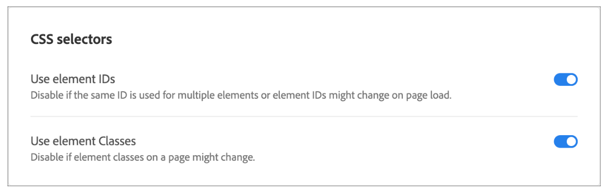

# Adobe Target: VEC를 통해 페이지의 이미지에 링크를 추가할 수 없습니다

## 설명 {#description}

<b>환경</b>
Adobe Target

<b>문제</b>
이미지에 링크를 추가하는 VEC를 통해 활동을 만들 수 있습니다.
그러나 QA URL/콘텐츠 전달을 사용하면 링크가 작동하지 않을 수 있습니다.

<b>원인</b>
이는 Adobe Target이 DOM 요소를 로드하기 전에 모든 선택기를 폴링한다는 사실 때문이며, 이 이미지 ID가 &quot;실행 시&quot;에 만들어지므로 선택기를 찾을 수 없으므로 이 ID에 링크를 적용하는 다음 작업이 실행되지 않습니다.

## 해결 방법 {#resolution}

<b>솔루션</b>
이러한 시나리오에서는 이미지 링크를 편집하려고 하는 활동에 아래 내용을 변경합니다.

1. 활동을 편집합니다.
2. G 를 클릭합니다.<b>귀</b> 버튼 및 <b>사이트 환경 설정</b>.

       

3. 비활성화 <b>요소 ID 사용</b> 및 <b>저장</b> 그래
4. 클릭 <b>다음</b> 및 <b>저장</b> 활동.

이것은 문제를 해결하는 데 도움이 될 것입니다.
