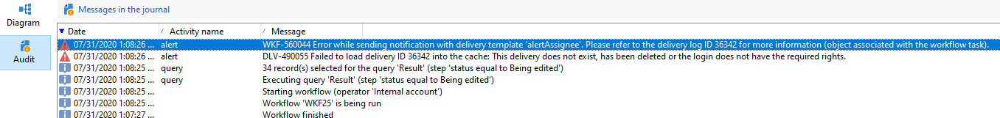

# 게재 테이블에서 쿼리 후 보강 활동이 추가되면 경고 활동이 실패합니다

## 설명 {#description}

<b>환경</b>
Campaign

## 해결 방법 {#resolution}

이 문제를 해결하기 위해 R&amp;D를 위해 NEO-25157이 생성되었으며 이후 이 문제는 빌드 9330에서 수정되었습니다.

<b>원인</b>

이 버그는 빌드 9032에서 쿼리 시 데이터 보강 활동이 추가되는 알려진 버그입니다<b> </b>게재 상태에서 게재 테이블에서 수행됩니다. 데이터 보강 작업의 수행 여부와 상관없이 경고 활동이 실패합니다

데이터 보강 없이 성공:

데이터 보강 실패:

감사 로그: <b>*게재 ID \*\*\*\*\*\*를 캐시에 로드하지 못했습니다.....</b>*

