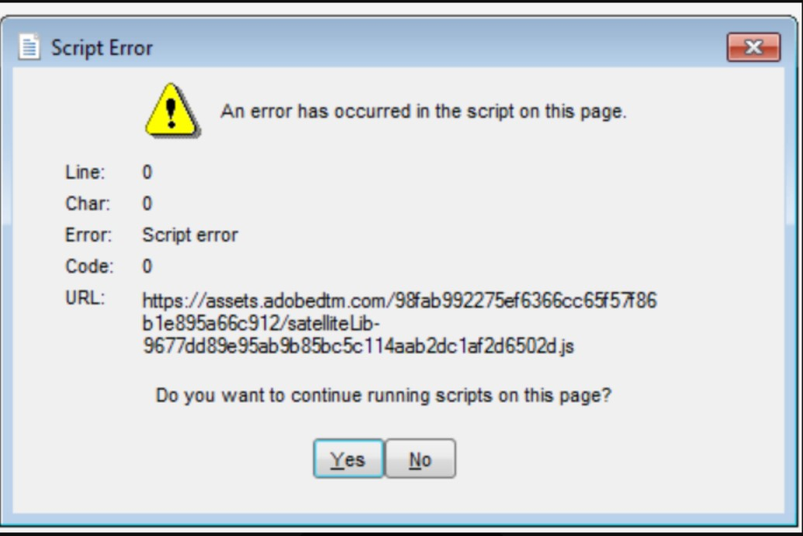

# Campaign Classic - 로그인하는 동안 스크립트 오류/경고

이 문서에서는 로그인 시 Campaign Classic에 스크립트 오류가 표시되는 문제를 해결합니다. &quot;이 페이지의 스크립트에 오류가 발생했습니다.&quot;

## 설명 {#description}

<b>환경</b>

Campaign Classic

<b>문제/증상</b>

- Campaign Classic이 로그인 시 스크립트 오류 팝스: &quot;이 페이지의 스크립트에 오류가 발생했습니다.&quot;
- 사용자가 &quot;아니요&quot;를 클릭한 후 로그인을 계속할 수 있습니다.

## 해결 방법 {#resolution}

<b>해결 방법/해결 방법</b>

Javascript maxMB 매개 변수를 늘립니다. https://experienceleague.adobe.com/docs/campaign-classic/using/installing-campaign-classic/appendices/the-server-configuration-file.html?lang=en#javascript

<b>원인</b>

기본 maxMB 매개 변수 설정은 512입니다. 가비지 수집기를 실행하기 전에 허용되는 최대 크기(MB)를 설정합니다. 이 설정이 불충분한 경우가 있으므로 메모리 할당을 늘려 수정할 수 있는 스크립트 오류가 발생합니다.
