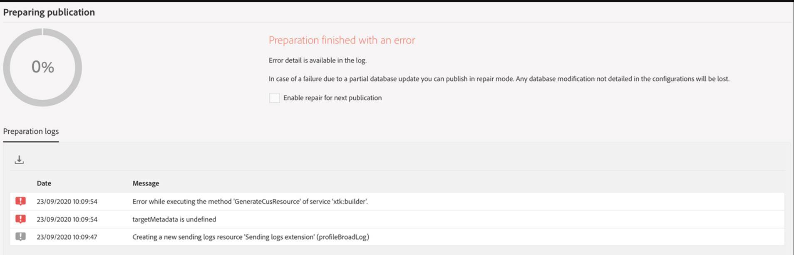

# [캠페인] 스테이징에서 패키지를 가져올 때 오류 발생

## 설명 {#description}

<b>환경</b>
- 스테이징에서 프로덕션 환경으로 패키지 가져오기
- 패키지에 새 사용자 지정 리소스가 있습니다.

<b>증상</b>
- 오류로 가져오기 실패: 준비에 오류가 발생했습니다.

## 해결 방법 {#resolution}

해결 단계/해결 방법
- 전송 로그 엔티티를 사용하지 않고 패키지 다시 내보내기
- 새 패키지 가져오기

<b>원인</b>
- 전송 로그 엔티티를 내보낼 필요가 없습니다. 프로필이 게시되면 다시 만들어집니다.
