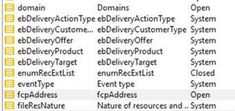

# 이모티콘 열거형

## 설명

<b>환경</b>
- Campaign Classic
- Campaign
- Campaign Standard

<b>문제/증상</b>
에 따라 [팔로잉](https://experienceleague.adobe.com/docs/campaign-classic/using/sending-messages/personalizing-deliveries/customizing-emoticon-list.html?lang=en#add-new-emoticon) 문서, 열거 아래에 OOTB 이모티콘 목록을 가질 수 있습니다.
[https://experienceleague.adobe.com/docs/campaign-classic/using/sending-messages/personalizing-deliveries/customizing-emoticon-list.html?lang=en#add-new-emoticon](https://experienceleague.adobe.com/docs/campaign-classic/using/sending-messages/personalizing-deliveries/customizing-emoticon-list.html?lang=en#add-new-emoticon)

그러나 이 목록이 사용자에게 표시되지 않습니다. 설치해야 하는 패키지나 구성해야 하는 다른 항목이 있습니까?

## 해결 방법

이 기능은 9178년에 도입된 새로운 기능입니다. 다음을 확인하십시오. [릴리스 정보](https://experienceleague.adobe.com/docs/campaign-classic/using/release-notes/previous-releases/release--20-2.html?lang=en#release-20-2-1-build-9178) 자세한 내용은 Experience League 설명서 를 참조하십시오.

사용자는 서버 빌드와 동일한 콘솔 버전에 있어야 이모티콘 메뉴를 표시할 수 있습니다.
