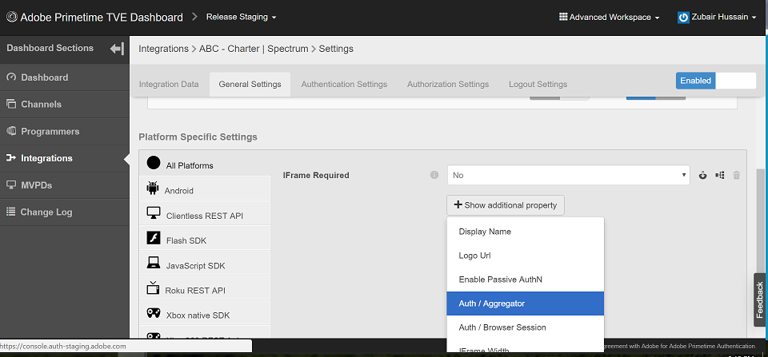

# 내 채널에 대해 SSO가 활성화되었는지 또는 비활성화되었는지 어떻게 확인할 수 있습니까?

## 설명

 환경  
사전 준비 스테이징, 사전 프로덕션, 릴리스 스테이징 및 릴리스 프로덕션

## 해상도

 SSO는 모든 통합에 대해 기본적으로 활성화되어 있지만 SSO가 비활성화되도록 구성되어 있습니다.  SSO가 비활성화되었는지 확인하려면 TVE 대시보드에서 통합을 검토할 수 있습니다.  채널 - MVPD 통합에 대해 SSO가 비활성화된 경우 다음 속성이 YES로 설정됩니다.  
1. 인증 / 누적 — 예
2. 수동 인증 사용 — 예

설정이 설정되지 않았거나 NO로 설정되지 않은 경우에는 통합에 SSO를 사용할 수 있습니다. 이러한 설정을 NO로 변경하면 SSO를 활성화할 수도 있습니다.  특정 통합으로 이동하여 이러한 설정을 찾을 수 있습니다(반드시 [!UICONTROL 고급 작업 공간] 선택).
1. TVE 대시보드에서 특정 통합을 클릭합니다.
2. 을(를) 선택합니다 [!UICONTROL 일반 설정] 탭을 선택하고 아래로 스크롤합니다.
3. &quot; 버튼을 클릭합니다.[!UICONTROL 추가 속성 표시]&quot; 값을 보려면 [!UICONTROL 인증 / 누적] 및 [!UICONTROL 수동 AuthN 활성화]. 
