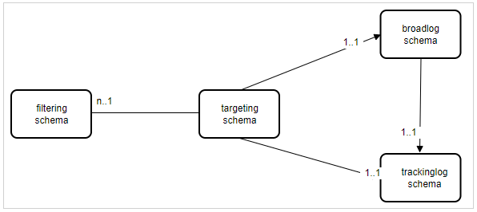

# Campaign Classic: 게재에서 프로필을 미리 볼 때 오류가 생성됩니다

## 설명

게재 미리 보기에서 &quot;게재 Target 채우기&quot; 옵션을 선택하여 프로필을 미리 볼 때 문제가 보고되었습니다. 기본적으로 다음 오류가 생성되는 중입니다.

## 해상도

문제는 게재 로그 및 추적 로그 스키마가 동일하지 않은 확장된 수신자 스키마를 기반으로 대상 매핑을 사용하는 것입니다. 대상 매핑은 수신자 스키마와 게재 로그/추적 로그 스키마 측면에서 고유해야 합니다.

추적 워크플로우는 타겟팅 ID로 데이터를 조정할 수 없으므로 동일한 추적 로그 스키마로 여러 타깃팅 스키마를 사용할 수는 없습니다.

고객이 OB 대상 매핑을 사용하지 않으려는 경우(nms:recipient와 함께) 다음 두 가지 방법을 권장합니다.

- 사용자 지정 타깃팅 차원을 사용하려면 nms:broadlog를 템플릿으로 사용하여 사용자 지정 broadLog/trackingLog 스키마를 만들어야 합니다(c.f nms:broadLogRcp, nms:broadLogSvc 등)

   - 타겟팅 스키마: cus:recipient (nms:recipient 또는 완전히 사용자 지정에서 확장)
   - 브로드캐스트 로그 스키마: cus:broadLogRcp(nms:broadLogRcp 또는 완전히 사용자 지정에서 확장)
   - 추적 로그 스키마: cus:trackingLogRcp(nms:broadLogRcp 또는 완전히 사용자 지정에서 확장)
- OOB trackingLogRcp/broadLogRcp를 사용하려면 <b>타겟팅 차원은 nms:recipient여야 하며 필터링 차원은 사용자 지정 스키마일 수 있습니다</b>
