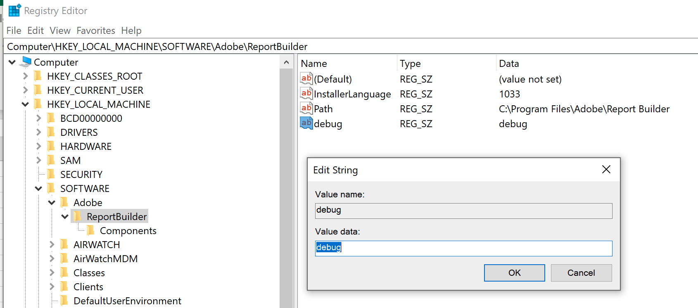

# Analytics - Report Builder 세부 정보 로깅

## 설명

<b>환경</b>
- Customer Journey Analytics
- Analytics

<b>문제/증상</b>
로그인 시 로깅 상자가 작동하지 않는지 확인할 때 ARB에서 로그인을 켜는 방법

## 해상도

Windows에서 레지스트리 열기: [https://support.microsoft.com/en-us/windows/how-to-open-registry-editor-in-windows-10-deab38e6-91d6-e0aa-4b7c-8878d9e07b11](https://support.microsoft.com/en-us/windows/how-to-open-registry-editor-in-windows-10-deab38e6-91d6-e0aa-4b7c-8878d9e07b11)

다음 폴더 중 하나를 찾습니다. 경로 및 파일 이름은 ARB 비트 버전 등에 따라 약간 다를 수 있습니다.

Computer\HKEY_LOCAL_MACHINE\SOFTWARE\WOW6432Node\Adobe\ReportBuilder

또는

Computer\HKEY_LOCAL_MACHINE\SOFTWARE\Adobe\ReportBuilder

마우스 오른쪽 버튼 클릭

새 문자열 추가

값 이름 입력

&#39;debug&#39;의 값 데이터 입력

