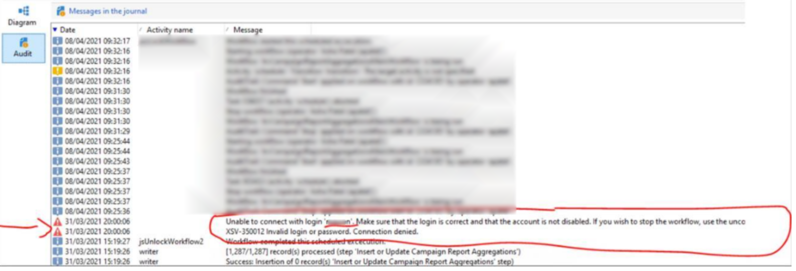

# ACC || WF가 실행되지 않는 사용자

## 설명

내 클라이언트 중 하나에 회사를 떠난 사용자를 비활성화하여 보고서 생성 워크플로우를 중지했습니다. 액세스 관리에서 Campaign Classic에서 사용자를 비활성화하면 WF에서 여전히 오류가 발생합니다. 사용자를 다시 활성화하려고 했으며 이제 워크플로우를 실행합니다. 그러나 사용자를 비활성화했을 때 왜 중단되었습니까? 그리고 어떻게 하면 그 사람을 무력화시키는 한 계속 일을 할 수 있을까요?

## 해상도

스크린샷을 사용한 질문 —

내 클라이언트 중 하나에 회사를 떠난 사용자를 비활성화하여 보고서 생성 워크플로우를 중지했습니다. 의 Campaign Classic에서 사용자를 비활성화하는 경우 [!UICONTROL 액세스 관리]로 설정되어 있어도 WF에 오류가 발생합니다. 사용자를 다시 활성화하려고 했으며 이제 워크플로우를 실행합니다. 그러나 사용자를 비활성화했을 때 왜 중단되었습니까? 그리고 어떻게 하면 그 사람을 무력화시키는 한 계속 일을 할 수 있을까요?

고객이 WF를 사용할 수 있도록 사용자를 제거하는 다른 방법이 있는지 알려주시겠습니까?

솔루션 --

이 오류가 발생할 때마다

1. 워크플로우를 엽니다.
2. 클릭 [!UICONTROL 편집]  XML 소스 편집..
3. 키워드 검색 <b>`login=”`</b>
4. 다음과 같이 XML에 요소가 있습니다
5. 사례 로그인에는 값이 있습니다<b>.</b>
6. 이 작업을 수행할 로그인 속성을 비웁니다. <b>`login=””`</b>
7. 클릭 [!UICONTROL 확인] 팝업 창을 닫으려면 다음을 수행하십시오.
8. 워크플로우를 저장합니다.
9. 워크플로우를 다시 시작합니다. 워크플로우가 [!DNL Campaign] (사례 중 99%가 해당됨), 고객 측의 관련 사용자에게 의 내에서 ID를 사용하여 이 워크플로우를 다시 시작하도록 요청하십시오 [!DNL Campaign] 워크플로우 폴더가 아닙니다.
10. 지금 수정해야 합니다.
11. 나중에 워크플로우 보기 폴더로 이동하여 검색할 수 있습니다 <b>*`mdata contains login=”username”`</b>*영향을 받을 수 있는 기타 워크플로우 검색
12. 각각에 대해 위의 단계를 반복합니다.

이게 도움이 됐으면 좋겠네요
