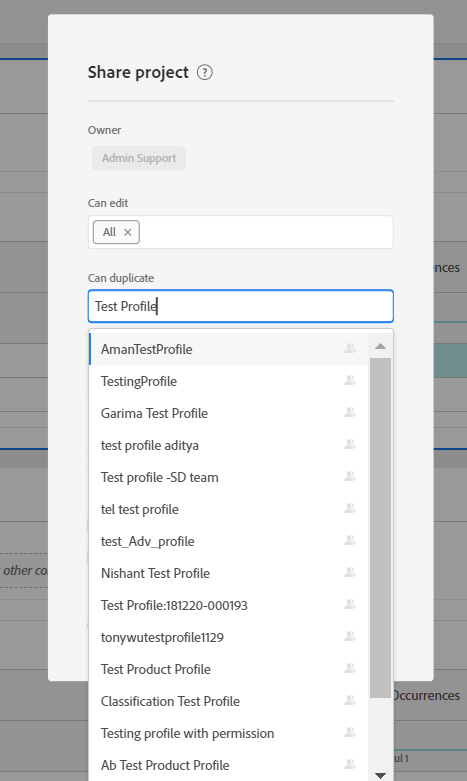

# 작업 공간 프로젝트를 공유하는 동안 제품 프로필을 사용할 수 있도록 하기 위한 전제 조건

## 설명

제품 프로필에는 &#39;X&#39;의 사용자와 작업 공간 프로젝트를 공유하는 동안 드롭다운에서 &#39;X&#39;를 사용할 수 없을 수 있다고 표시됩니다.

## 해상도

작업 공간 프로젝트를 공유하는 동안 드롭다운에서 제품 프로필을 사용할 수 있게 하려면 Admin Console에서 제품 프로필과 연관된 Analytics 권한이 있어야 합니다. 제품 프로필 &#39;X&#39;에 임의 권한이 추가되면 Analysis Workspace 프로젝트를 공유하는 동안 드롭다운에서 해당 권한이 표시되기 시작해야 합니다.

위의 예에서, 권한 없이 새로 만들 때 제품 프로필 &#39;테스트 프로필 X&#39;를 드롭다운 옵션에서 사용할 수 없었습니다. 그러나 사용 권한을 추가하면 활성화됩니다.

<b>참고:</b> 제품 프로필 &#39;X&#39;에 할당된 모든 권한이 Admin Console에서 해지되면 제품 프로필 &#39;X&#39;는 <b>여전히 </b>프로젝트 공유 드롭다운에서 계속 사용할 수 있습니다.

     
