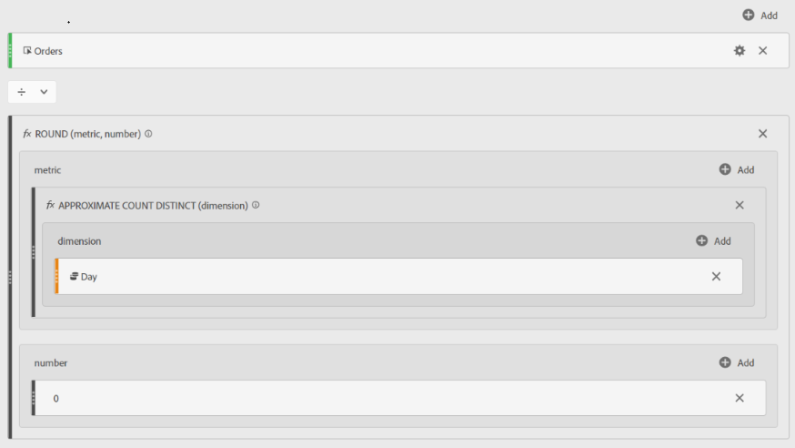

# Adobe Analytics의 평균 일일 주문

## 설명

Adobe Analytics에서 평균 일별 주문을 찾기 위한 계산된 지표

## 해상도

<u><b>면책조항</b></u>: 아래 사용자 지정 지표는 &quot;[!UICONTROL 대략적인 고유 개수]&quot; 함수를 사용합니다. 이름에서 알 수 있듯이 이것은 100% 정확한 지표는 아니지만, 결과는 실제 값의 95% 내에 있을 것입니다.

