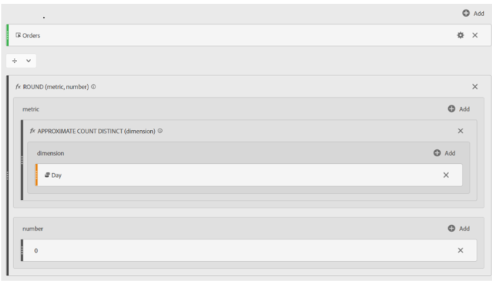

# Adobe Analytics의 평균 일일 주문

&quot;근사 고유 개수&quot; 기능을 사용하여 Adobe Analytics에서 평균 일일 주문을 푸는 방법을 알아봅니다.

## 설명 {#description}

### 환경

Adobe Analytics

### 문제/증상

Adobe Analytics에서 평균 일일 주문을 계산하는 방법.

## 해결 방법 {#resolution}

<u><b>면책조항</b></u>: 아래의 사용자 지정 지표는 &quot;근사 고유 개수&quot; 기능을 사용합니다. 이름에서 알 수 있듯이 이것은 100% 정확한 지표는 아니지만, 결과는 시간의 95% 동안 실제 값의 5% 이내에 속할 것이 보장됩니다.

