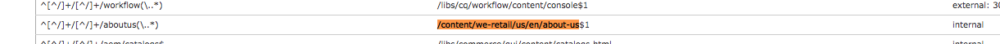

# Dispatcher 별칭 URL

## 설명 {#description}

<b>환경</b>
Experience Manager

<b>문제/증상</b>
이 문서는 AEM에서 컨텐츠 전송 가장자리에 더 가깝게 매핑하기 위해 규칙 다시 작성을 사용하여 단축 URL 및 일부 추가 기법을 처리하는 방법을 이해하는 데 도움이 됩니다

단축 URL 소개

의미가 있는 폴더 구조에 들어 있는 컨텐츠가 있는 경우 참조하기 쉬운 URL에 항상 존재하는 것은 아닙니다.  단축 URL은 단축키와 유사합니다.  실제 컨텐츠가 존재하는 위치를 참조하는 더 짧거나 고유한 URL입니다.

예: <b>/aboutus</b> 중요 시점 <b>/content/we-retail/us/en/about-us.html</b>

AEM 작성자는 AEM의 컨텐츠 일부에 대한 단축 url 속성을 설정하고 이를 게시할 수 있는 옵션이 있습니다.

이 기능을 사용하려면 단축 통과를 허용하도록 Dispatcher 필터를 조정해야 합니다.  이는 작성자가 이러한 단축 페이지 항목을 설정해야 하는 비율로 Dispatcher 구성 파일을 조정하는 것과 같이 비합리적입니다.

이러한 이유로 Dispatcher 모듈에는 콘텐츠 트리에 단축으로 나열된 모든 항목을 자동으로 허용하는 기능이 있습니다.

## 해결 방법 {#resolution}

작동 방식

단축 URL 작성

작성자는 AEM의 페이지를 방문하고 페이지 속성을 방문하고 vanity url 섹션에 항목을 추가합니다.
변경 사항을 저장하고 페이지를 활성화하면 이제 이 페이지에 단축이 할당됩니다.
Touch UI:

클래식 컨텐츠 파인더:

참고: 이는 이름 공간 문제에 매우 취약합니다.
단축 항목은 모든 페이지에 전역적으로 적용되며 해결 방법을 계획해야 하는 짧은 작업 중 하나에 불과합니다. 그 중 몇 가지는 나중에 설명해 드리겠습니다.
리소스 확인/매핑

내부 리디렉션을 위한 각 단축 항목은 sling 맵 항목입니다.
이러한 맵은 AEM 인스턴스 Felix 콘솔(<b>/system/console/jcrresolver</b>) 단축 항목으로 만든 맵 항목의 스크린샷은 다음과 같습니다.

위의 예에서 AEM 인스턴스에 /aboutus를 방문하도록 요청하면 /content/we-retail/us/en/about-us.html으로 확인됩니다.

Dispatcher 자동 허용 필터

보안 상태의 Dispatcher는 JCR 트리의 루트이므로 Dispatcher를 통해 요청을 필터링합니다.
게시자가 /content 및 기타 안전한 경로 등의 콘텐츠만 허용하고 /system 등과 같은 경로는 허용하지 않는지 확인하는 것이 중요합니다. 다음은 /의 기본 폴더에 있는 rub, vanity url입니다. 어떻게 이러한 url이 보안을 유지하면서 게시자에게 도달할 수 있도록 허용합니까?
단순 Dispatcher에는 자동 필터 허용 메커니즘이 있으며 AEM 패키지를 설치한 다음 해당 패키지 페이지를 가리키도록 Dispatcher를 구성해야 합니다.
[https://experience.adobe.com/#/downloads/content/software-distribution/en/aem.html?package=/content/software-distribution/en/details.html/content/dam/aem/public/adobe/packages/granite/vanityurls-components](https://experience.adobe.com/#/downloads/content/software-distribution/en/aem.html?package=/content/software-distribution/en/details.html/content/dam/aem/public/adobe/packages/granite/vanityurls-components)
Dispatcher의 팜 파일에는 구성 섹션이 있습니다.

<b>/vanity_urls {</b><b> </b><b>    </b><b> </b><b>/url &quot;/libs/granite/dispatcher/content/vanityUrls.html&quot;</b><b> </b><b>    </b><b> </b><b>/file &quot;/tmp/vanity_urls&quot;</b><b> </b><b>    </b><b> </b><b>/delay 300</b><b> </b><b>}</b>

 
이 구성은 Dispatcher가 허용하려는 항목 목록을 가져오기 위해 300초마다 시작하는 AEM 인스턴스에서 이 URL을 가져오도록 합니다.
/tmp/vanity_urls 이 예에서 /file 인수에 응답의 캐시를 저장합니다. 따라서 URI의 AEM 인스턴스를 방문하면 해당 인스턴스가 가져오는 내용이 표시됩니다.

이것은 매우 간단한 목록입니다.

단축 규칙으로 규칙 다시 작성

위에서 설명한 대로 AEM에 내장된 기본 메커니즘 대신 규칙 다시 작성을 사용하는 것이 언급되는 이유는 무엇입니까?
간단히 설명하면, 네임스페이스 문제, 성능 및 더 높은 수준의 로직을 효과적으로 처리할 수 있습니다.
단축 항목의 예를 살펴보겠습니다 */aboutus* 콘텐츠에 */content/we-retail/us/en/about-us.html* apache의 mod_rewrite 모듈을 사용하여 이를 달성합니다.

<b>재작성 규칙 /aboutus /content/we-retail/us/en/about-us.html PT,L,NC</b>

이 규칙은 단축 /aboutus를 찾고 PT 플래그(통과)를 사용하여 렌더러에서 전체 경로를 가져옵니다.
또한 다른 모든 규칙 L 플래그(마지막) 처리를 중지하므로 JCR 해결과 같은 거대한 규칙 목록을 탐색하지 않아도 됩니다.
요청을 프록시하지 않아도 되고 AEM 게시자가 이 두 가지 방법으로 응답할 때까지 기다리면 더 많은 성능이 발휘됩니다.
금상첨화는 NC 플래그(대/소문자 구분 안 함)입니다. 즉, 고객이 /aboutus 대신 /AboutUs로 URI를 전달하면 여전히 작동하며 올바른 페이지를 가져올 수 있습니다.
재작성 규칙을 만들어 수행하려면 Dispatcher에 구성 파일을 만들고(예: /etc/httpd/conf.d/rewrites/examplevanity_rewrite.rules) 이러한 단축 URL이 적용되어야 하는 도메인을 처리하는 .vhost 파일에 이를 포함합니다.
다음은 include의 예제 코드 조각입니다

/etc/httpd/conf.d/enabled_vhosts/we-retail.vhost VirtualHost \*:80 ServerName weretail.com ServerAlias www.weretail.com ........ 캡처 ........     IfModule mod_rewrite.c ReWriteEngine on LogLevel warn rewrite:info Include /etc/httpd/conf.d/rewrites/examplevanity_rewrite.rules / IfModule ........ 캡처 ......../VirtualHost

사용 방법 및 위치

AEM을 사용하여 단축 항목을 제어하면 다음과 같은 이점이 있습니다

- 작성자는 즉석으로 만들 수 있습니다
- 콘텐츠와 함께 라이브하며 콘텐츠와 함께 패키지화할 수 있습니다

mod_rewrite를 사용하여 단축 항목을 제어하면 다음과 같은 이점이 있습니다

- 신속한 컨텐츠 해결
- 최종 사용자 콘텐츠 요청의 가장자리에 더 가깝게
- 기타 조건에서 컨텐츠가 매핑되는 방식을 제어하는 더 많은 확장성 및 옵션
- 대/소문자를 구분하지 않을 수 있음

두 가지 방법을 모두 사용하되 다음 경우에 사용할 권고 사항 및 기준은 다음과 같습니다.

- 단축이 임시적이고 계획된 트래픽이 낮은 수준인 경우 AEM 내장 기능을 사용하십시오
- 단축이 자주 변경되지 않고 자주 사용하는 스테이플 끝점인 경우 mod_rewrite 규칙을 사용하십시오.
- 단축 네임스페이스(예: /aboutus)를 동일한 AEM 인스턴스의 많은 브랜드에 대해 재사용해야 하는 경우 규칙 다시 작성을 사용하십시오.

참고: AEM 단축 기능을 사용하고 네임스페이스를 사용하지 않으려면 명명 규칙을 만들 수 있습니다.  /brand1/aboutus, brand2/aboutus, brand3/aboutus와 같이 중첩된 단축 URL 사용
