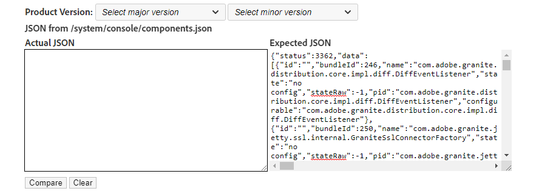

# Experience Manager - 업데이트 후 OSGi 번들 버전의 유효성을 검사하는 방법

## 설명 {#description}

<b>환경</b>
Adobe Experience Manager

<b>문제/증상</b>
업데이트 후 OSGi 번들 버전을 확인하여 성공적인 설치를 확인하는 방법은 무엇입니까?

## 해결 방법 {#resolution}

<b>해결 단계</b>
1. 에서 JSON 복사/붙여넣기 <b>*http://aemhost1:port/*system/console/bundles.json</b> (으)로 <b>실제 JSON</b> 텍스트 필드.
2. 선택 <b>제품 버전</b> 다음에서 *주요 버전* 및 *부 버전* 드롭다운 메뉴를 사용하여 <b>예상 JSON</b> 필드 또는 다른 AEM 인스턴스에서 로 JSON 복사/붙여넣기 <b>예상 JSON</b> 필드(에서) <b>*http://aemhost2:port/*system/console/bundles.json</b>).
3. 클릭 <b>비교</b> 차이를 봅니다.\
   

<b>비교 결과</b>

1. *유사* 번들은 흰색으로 표시되며, *다른 항목* 번들 버전은 노란색으로 표시되며, *새로 추가됨* 번들은 바다색으로 표시되며, *삭제됨* 연한 빨간색으로 묶음.
2. 다음을 사용하여 데이터 필터링 <b>필터</b> 상자.\
   

\* 감사합니다. [샴 순다르 하산 치케고우다](https://www.linkedin.com/in/sham-sundar-hassan-chikkegowda-6b03a517) 원본을 제공하기 위한 [소스 코드](https://github.com/Schikkeg/schikkeg.github.io/blob/master/tools/coi.html) 이 도구에 사용할 수 있습니다. 그의 개인 사이트는 방문하실 수 있습니다 [여기](https://www.aemstuff.com/).
