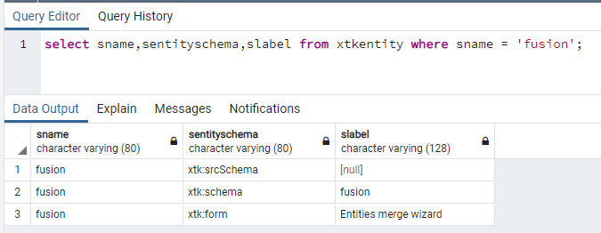

# XML-110011 속성 &#39;name&#39;이 &#39;fusion&#39;으로 설정된 요소 &#39;element&#39;를 찾을 수 없습니다(스키마가 있는 문서).

## 설명

<b>On-prem 사용자의 경우</b>     Campaign 인스턴스를 ACC-21.1 build 9342 이상으로 업그레이드한 후 Campaign 패키지를 설치하려고 하면 다음 오류가 발생합니다.     

## 해상도

업그레이드 후 과정에서 융합 스키마(xtk:fusion)를 삭제해야 합니다. 그러나 경우에 따라 스키마가 여전히 있습니다.

데이터베이스를 다음과 같이 쿼리하면 다음 레코드가 표시될 수 있습니다.

xtk:fusion 스키마를 제거하려면 &quot;-force&quot; 옵션을 사용하여 업그레이드 후 도구를 실행해야 합니다.

`nlserver config -postupgrade -allinstances -force`

다음 항목이 표시됩니다.

스키마가 계속 있으면 &quot;-force-repair&quot; 옵션을 사용하여 시도할 수 있습니다.

`nlserver config -postupgrade -allinstances -force -repair`

그래도 작동하지 않으면 데이터베이스에서 수동으로 레코드를 제거해야 할 수 있습니다.
