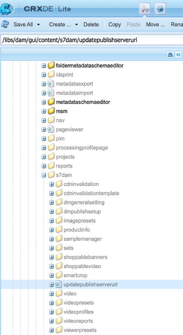
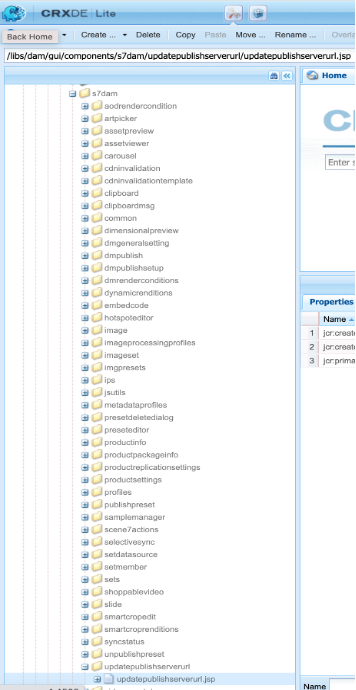
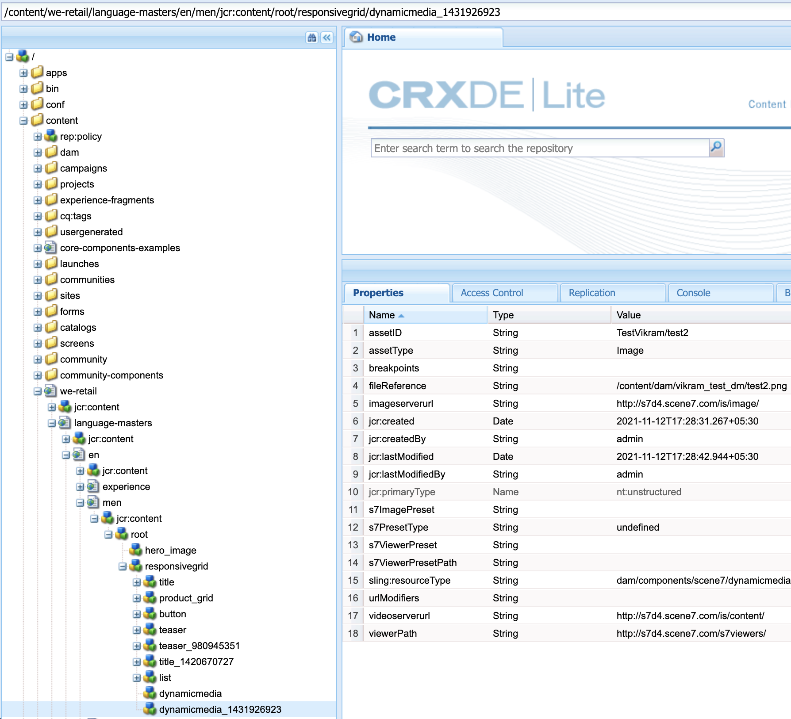

# DM 자산에 대한 Dynamic Media URL 변경

이 문서에서는 DM 에셋에 대한 Dynamic Media URL을 변경하는 방법을 설명합니다.

## 설명 {#description}

### 환경

- Experience Manager Assets
- Experience Manager 6.5

### 문제/증상

Adobe Experience Manager(AEM) 작성자 인스턴스(버전 6.5.11 이상)에서 일반 설정 섹션을 사용하여 DM 서버 설정을 구성하고 DM 자산에 대한 게시 서버 URL 또는 Dynamic Media URL을 변경할 수 있습니다.

Dynamic Media 일반 설정 페이지를 열려면 AEM 작성자 인스턴스에서 <b>도구</b>로 이동한 다음 로 이동합니다. <b>에셋</b>로 이동한 다음 로 이동합니다. <b>Dynamic Media 일반 설정</b>.

AEM 작성자 인스턴스에서 Dynamic Media을 구성했는지 확인합니다. 클릭 <b>도구</b>로 이동한 다음 로 이동합니다.<b> Cloud Service</b> 다음으로 이동 <b>Dynamic Media 구성</b>.

게시된 서버 이름은 Dynamic Media 계정과 관련된 모든 시스템 생성 URL 호출에 사용되는 CDN(Content Deliver Network) 서버입니다.

사용자 정의 도메인 이름이 Adobe의 CDN(Content Distribution Network) 서버에 매핑되어 있는지 확인하거나 자체 CDN 공급자 도메인 이름을 사용하는 경우 Origin Server에 매핑되어 있는지 확인하십시오.\*

\*자세한 내용은 Dynamic Media 지원 Adobe에 문의하십시오.

## 해결 방법 {#resolution}

게시된 서버 이름을 변경한 후 변경 사항을 저장하십시오. 변경 안 함 <b>원본 서버 이름</b> Adobe Dynamic Media 지원 기술자가 지시하지 않은 경우.

Sites 페이지에서 기존 Dynamic Media 구성 요소에 대한 게시된 서버 이름을 변경하는 지침:

- 첨부된 패키지를 설치하여 게시 서버 URL 노드를 만듭니다.
- 패키지가 설치되면 AEM 작성자에 2개의 파일이 생성되었음을 알 수 있습니다

   - [/libs/dam/gui/content/s7dam/updatepublishserverurl](http://vgaur-wx-1:4502/crx/de/index.jsp#/crx.default/jcr%3aroot/libs/dam/gui/content/s7dam/updatepublishserverurl "CRXDE Lite에서 경로 보기")
   - [/libs/dam/gui/components/s7dam/updatepublishserverurl/updatepublishserverurl.js](http://vgaur-wx-1:4502/crx/de/index.jsp#/crx.default/jcr%3aroot/libs/dam/gui/components/s7dam/updatepublishserverurl/updatepublishserverurl.jsp "CRXDE Lite에서 경로 보기")p

.         

- &#x200B;&#x200B;&#x200B;AEM Sites&#x200B;path&#x200B; &#x200B;이 URL: http://에서 &quot;path&quot; 매개 변수를 입력합니다&#x200B;.`<` aem-server`>` :portnumber/libs/dam/gui/content/s7dam/updatepublishserverurl.html?path/content/mysite&amp;update=true&#x200B;&#x200B;&#x200B;&#x200B;&#x200B; &#x200B; &#x200B;=
- 해당 URL을 제공하면 언급된 AEM Sites 경로의 모든 Sites 페이지에서 모든 Dynamic Media 구성 요소에 대한 DM URL이 자동으로 업데이트되고 이 유형의 출력이 표시됩니다

모든 Dynamic Media 구성 요소 URL이 AEM 사이트의 새 게시된 서버 이름으로 변경됩니다.
이전 게시된 서버 이름을 사용하는 DM 구성 요소 보기입니다.

이 URL( http:// )을 히트한 후 DM 구성 요소 보기, 게시된 서버 이름 변경.`<` aem-server`>` :portnumber/libs/dam/gui/content/s7dam/updatepublishserverurl.html?path=/content/mysite&amp;update=true

참고: AEM Sites 경로의 모든 Dynamic Media 구성 요소 목록을 보려면 이 URL 을 호출할 수 있습니다. <u style="text-decoration:underline">http://`<` aem-server`>` :portnumber/libs/dam/gui/content/s7dam/updatepublishserverurl.html?path=/content/mysite</u>

&#x200B;&#x200B;&#x200B; &#x200B; &#x200B;&#x200B;&#x200B;
