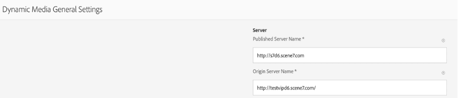

# DM용 Dynamic Media URL 변경 [!DNL Assets] (AEM 6.5.11 이상에서)

## 설명

 AEM 작성자 인스턴스(버전 6.5.11 이상)에서 [!UICONTROL 일반 설정] DM 서버 설정 구성 및 변경 섹션 [!UICONTROL 게시 서버 URL] 또는 [!UICONTROL Dynamic Media URL] 참조하십시오.

 열려면 [!UICONTROL Dynamic Media 일반 설정] 페이지에서 AEM 작성자 인스턴스에서 을 클릭합니다. <b>[!UICONTROL 도구] - [!UICONTROL 자산] - [!UICONTROL Dynamic Media 일반 설정]</b>
         AEM 작성자 인스턴스에서 Dynamic Media을 구성했는지 확인하고 를 클릭합니다. [!UICONTROL 도구] - [!UICONTROL Cloud Services] - [!UICONTROL Dynamic Media 구성]

 게시된 서버 이름은 Dynamic Media 계정에만 적용되는 시스템 생성 URL 호출에 사용되는 CDN(Content Delivery Network) 서버입니다.          사용자 지정 도메인 이름이 Adobe의 CDN 서버에 매핑되거나, 고유한 CDN Provider의 도메인 이름을 사용하는 경우 Adobe에 매핑되어야 합니다 [!UICONTROL 원본 서버 이름 \*]

 \*자세한 내용은 Adobe Dynamic Media 지원 센터에 문의하십시오.  

## 해상도

게시된 서버 이름을 변경한 후 변경 내용을 저장하십시오. 변경하지 마십시오 <b>원본 서버 이름</b> Adobe Dynamic Media 지원 기술자가 지시를 받지 않는 한.

사이트 페이지에서 기존 Dynamic Media 구성 요소의 게시된 서버 이름을 변경하는 지침 :

- 게시 서버 URL 노드를 만들려면 첨부된 패키지를 설치합니다
- 패키지가 설치되면 AEM 작성자에 2개의 파일이 만들어집니다

   - [/libs/dam/gui/content/s7dam/updatepublishserverurl](http://vgaur-wx-1:4502/crx/de/index.jsp#/crx.default/jcr%3aroot/libs/dam/gui/content/s7dam/updatepublishserverurl "CRXDE Lite에서 경로 보기")
   - [/libs/dam/gui/components/s7dam/updatepublishserverurl/updatepublishserverurl.js](http://vgaur-wx-1:4502/crx/de/index.jsp#/crx.default/jcr%3aroot/libs/dam/gui/components/s7dam/updatepublishserverurl/updatepublishserverurl.jsp "CRXDE Lite에서 경로 보기")p

.         

- 이 URL의 &quot;path&quot; 매개 변수에 AEM Sites 경로를 입력합니다. http://aem-server:portnumber/libs/dam/gui/content/s7dam/updatepublishserverurl.html?path=/content/mysite&amp;update=true
- 해당 URL을 제공하면 지정된 AEM Sites 경로의 모든 사이트 페이지에 있는 모든 Dynamic Media 구성 요소의 DM URL이 자동으로 업데이트되고 이 유형의 출력이 표시됩니다

모든 Dynamic Media 구성 요소 URL은 AEM 사이트의 새 게시된 서버 이름으로 변경됩니다.
게시된 이전 서버 이름을 사용하는 DM 구성 요소 보기

이 URL을 히트한 후 게시된 서버 이름이 변경된 DM 구성 요소의 보기입니다. http://aem-server:portnumber/libs/dam/gui/content/s7dam/updatepublishserverurl.html?path=/content/mysite&amp;update=true

참고 : AEM Sites 경로에 있는 모든 Dynamic Media 구성 요소의 목록을 보려면 이 URL 을 호출할 수 있습니다. http://aem-server:portnumber/libs/dam/gui/content/s7dam/updatepublishserverurl.html?path=/content/mysite

