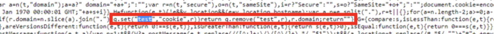

# VisitorAPI.js의 &quot;테스트&quot; 쿠키는 무엇입니까?

## 설명 {#description}

<b>환경</b>
- Customer Journey Analytics
- Analytics

<b>문제/증상</b>
VisitorAPI.js 내에서 이름이 &quot;test&quot;인 쿠키가 사용됩니다. 이것이 무엇에 쓰이는지 궁금하실 것입니다. 단순히 쿠키가 페이지에 쓰여진 다음 즉시 제거될 수 있는지 확인하기 위해 페이지에 쓰여집니다.

## 해결 방법 {#resolution}

- 쿠키 이름: 테스트
- 설명: 브라우저 쿠키 지원을 테스트하기 위해 작성된 내부 쿠키입니다.
- 기간: 즉시 만료됨
- 도메인: 웹 사이트 도메인에 작성됨
- 크기: JS 문자당 2바이트(쿠키가 의미 없는 문자 작성)
