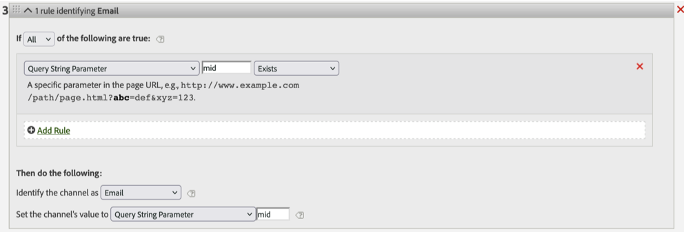

# 페이지 URL은 링크 추적 호출을 건너뜁니다

&quot;mid&quot; 쿼리 매개변수가 있는 페이지 URL이 &quot;이메일&quot; 채널에 속하는 Customer Journey Analytics Analytics 문제를 해결하는 방법을 알아봅니다. 서버 호출 유형이 다음과 같은지 확인 [링크 추적](https://experienceleague.adobe.com/docs/analytics/implementation/vars/functions/tl-method.html?lang=ko-KR) 예: 페이지 보기 대신 사용자 지정 링크.

## 설명 {#description}

### <b> 환경</b>

- Customer Journey Analytics
- Analytics

### <b>문제/증상</b>

아래와 같은 마케팅 채널 처리 규칙이 있는 경우 페이지 URL에 &quot;mid&quot; 쿼리 문자열 매개 변수가 있으면 &quot;이메일&quot; 채널에 속해야 합니다.
그러나 경우에 따라 아래에 표시된 것과 같은 &quot;mid&quot; 쿼리 매개변수가 있는 페이지 URL이 &quot;이메일&quot; 채널에서 무시되어 다른 채널에 속할 수 있습니다.
`[` 1`]`  [http://www.example.com/home.html?mid=123](http://www.example.com/home.html?mid=123)
`[` Image1`]`

## 해결 방법 {#resolution}

서버 호출 유형이 다음과 같은지 확인 [링크 추적](https://experienceleague.adobe.com/docs/analytics/implementation/vars/functions/tl-method.html?lang=ko-KR) 예: 페이지 보기 대신 사용자 지정 링크. 링크 추적 호출인 경우 설계된 대로 작동합니다.

 원인: 
Adobe 데이터 수집 서버는 모든 위치에서 pageURL 차원을 제거합니다 [링크 추적](https://experienceleague.adobe.com/docs/analytics/implementation/vars/functions/tl-method.html?lang=ko-KR) 이미지 요청. 따라서 페이지 URL 일치 규칙은 링크 추적 호출과 작동하지 않습니다.

자세히 알아보기 [페이지 URL](https://experienceleague.adobe.com/docs/analytics/implementation/vars/page-vars/pageurl.html?lang=ko-KR) .
