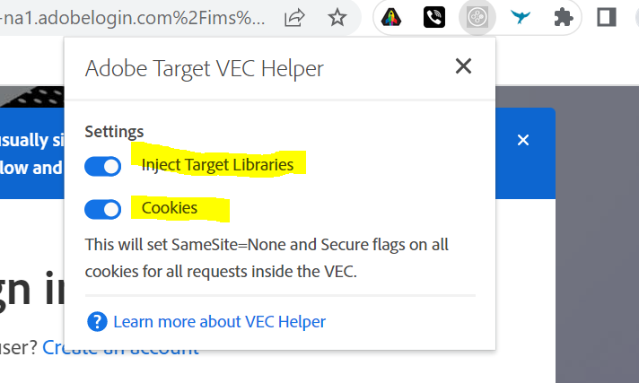

# Target VEC 디버깅/문제 해결

## 설명

 1. Adobe 대상 VEC에서 페이지 URL을 로드할 수 없습니다.      다음은 몇 가지 샘플 오류입니다.   a)      b)       c)   

## 해상도

1. 쿠키와 캐시를 지우거나 시크릿 모드에서 웹 사이트를 열어 보십시오. 
2. Mozilla Firefox, Microsoft Edge 3과 같은 대체 브라우저를 사용해 보십시오. 이 경우 VEC helper 브라우저 확장 프로그램 a)을 설치합니다. [https://chrome.google.com/webstore/detail/adobe-target-vec-helper/ggjpideecfnbipkacplkhhaflkdjagak](https://chrome.google.com/webstore/detail/adobe-target-vec-helper/ggjpideecfnbipkacplkhhaflkdjagak)
b) 확장 프로그램을 사용하려면 VEC에 있는 동안 Chrome 브라우저의 도구 모음에서 VEC Helper 브라우저 확장 프로그램 아이콘( )을 클릭합니다. 
c) &quot;<b>target 라이브러리 삽입</b>&quot; 및 &quot;cookies&quot;를 &quot;on&quot;으로 전환합니다.

d) 확장이 페이지에 대상 라이브러리를 추가할 수 있도록 허용하여 작성을 활성화해야 하는 팝업입니다.
e) 사이트 설정에서 비보안 콘텐츠를 허용합니다([https://experienceleague.adobe.com/docs/target/using/experiences/vec/troubleshoot-composer/mixed-content.html?lang=en](https://experienceleague.adobe.com/docs/target/using/experiences/vec/troubleshoot-composer/mixed-content.html?lang=en))

- 잠금(주의) 아이콘을 클릭한 다음 사이트 설정을 클릭합니다.
- 비보안 컨텐츠로 스크롤한 다음 드롭다운 목록을 사용하여 &quot;블록(기본값)&quot;을 &quot;허용&quot;으로 변경합니다.
- VEC 페이지를 다시 로드합니다.

f) 다음 절차에 따라 EEC(Enhanced Experience Composer)를 비활성화로 설정합니다

- Target-관리-VEC로 이동 - EEC 끄기

참고: - 문제가 계속 발생하면 브라우저 개발자 콘솔을 열고 오류 메시지를 찾습니다.
3. 웹 사이트에 여러 수준의 iframe이 포함된 경우 대상이 지원되지 않습니다. 

<b>VEC에서 로그인 후 페이지에 액세스하는 방법</b>
1. VEC에서 페이지를 로드하고 &quot;브라우저 탭&quot;을 클릭하고 자격 증명을 입력한 다음 원하는 페이지로 이동합니다. 
2. 작성 탭을 클릭하고 VEC 내에서 수정을 수행합니다. 
또는
1. 새 탭에서 웹 사이트를 열고 로그인 자격 증명을 입력합니다.
2. target에서 VEC를 열고 로그인 후 페이지를 직접 로드합니다. 
3. 이제 수정 작업을 수행하기 위해 페이지가 VEC에 로드됩니다.
