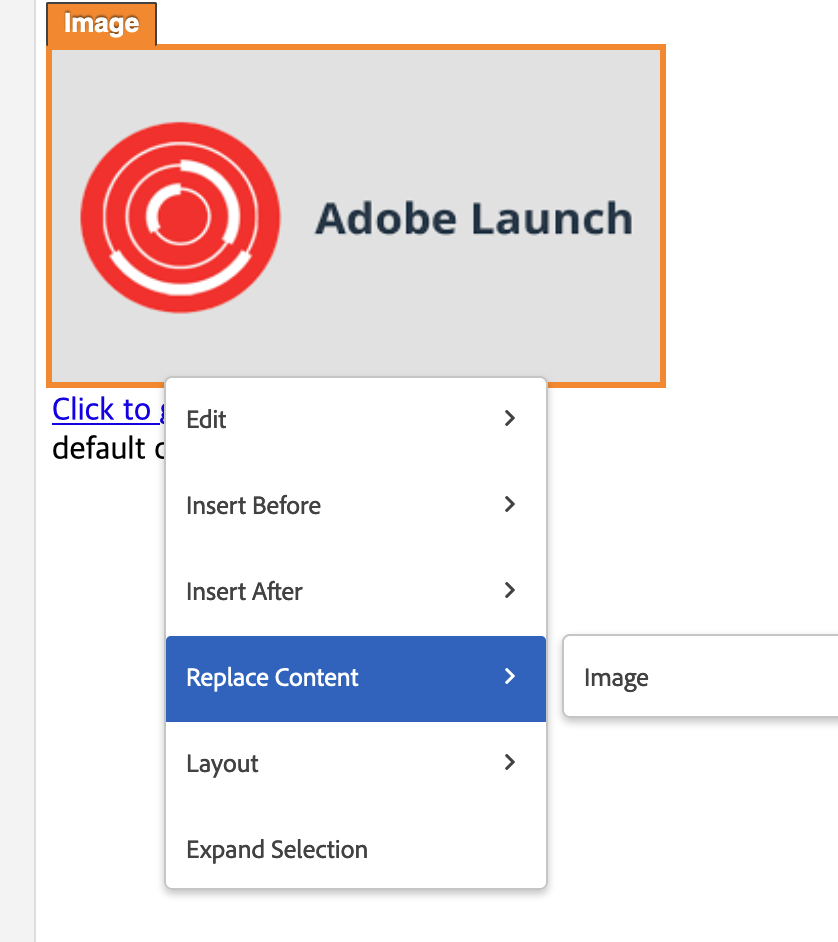

# 이미지 교환이 Target VEC에서 제대로 작동하지 않습니다

## 설명 {#description}

<b>환경</b>

- Adobe Target

<b>문제/증상</b>

Adobe Target VEC에서 Adobe Target VEC 컨텐츠 바꾸기 이미지를 통해 페이지의 이미지를 교체한 후 그림이 제대로 로드되지 않거나, VEC 편집 창 오른쪽의 수정 사항 창에 오류 아이콘이 있을 수 있습니다.

## 해상도 {#resolution}

&#39;선택 항목 확장&#39; 메뉴를 클릭하고 HTML 코드에서 srcset 속성 값을 대체하여 상위 컨테이너에서 HTML 편집 작업을 사용해 보십시오.

<b>원인</b>

VEC의 이미지 교체 작업은 img 태그의 src 특성을 기반으로 하며, srcset 속성에서 작동하지 않습니다.
