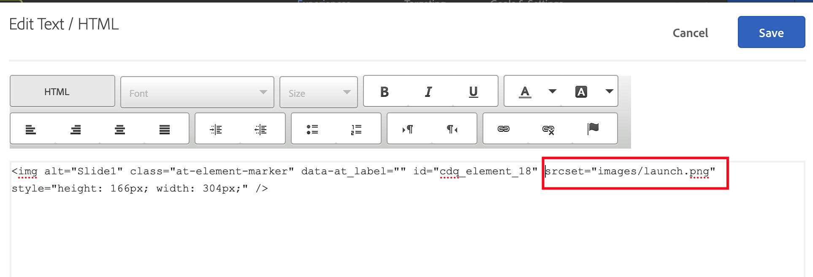

# 이미지 교환이 에서 제대로 작동하지 않습니다. [!DNL Target] VEC

## 설명

<b>문제:</b> Adobe Target VEC에서 Adobe Target VEC를 통해 페이지에서 이미지를 교체한 후 - [!UICONTROL 컨텐츠 바꾸기] - [!UICONTROL 이미지]로 설정되면 그림이 제대로 로드되지 않거나 오류 아이콘에 오류 아이콘이 표시될 수 있습니다 [!UICONTROL 수정 사항] vec 편집 창의 오른쪽에 있는 창.     

## 해상도

<b>해결 방법: </b>상위에서 HTML 편집 작업을 사용해 보십시오 [!UICONTROL 컨테이너] 를 클릭합니다. [!UICONTROL 선택 영역 확장] 메뉴 및 바꾸기 `srcset` HTML 코드의 속성 값.

<b>근본 원인:</b> VEC의 이미지 교체 작업은 다음 조건을 기반으로 합니다 `src` 속성 `img` 태그는에서 작동하지 않습니다 `srcset` 속성을 사용합니다.
