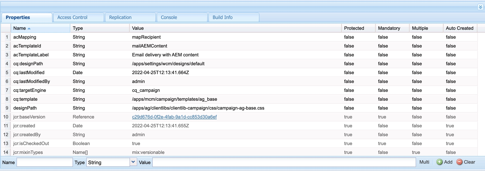

# AEM 이메일 템플릿이 Adobe Campaign과 동기화되지 않습니다.

## 설명 {#description}

<b>환경</b>

- Adobe Experience Manager

<b>문제/증상</b>

사용자가 Campaign 승인 워크플로우가 이미 실행된 사이트의 템플릿을 복사하여 붙여넣으려고 하면 Adobe Campaign에 대한 cq:acLinks 및 cq:acUUID 속성이 제거되지 않습니다.

이로 인해 Adobe 캠페인이 AEM에서 이메일 템플릿을 동기화할 수 없으며 오류가 발생합니다. cq:acLinks 및 cq:acUUID 속성이 고유한 속성으로 발견된 중복 acUUID입니다.

<b>재현할 절차:</b>

1: AEM에서 사이트의 이메일 템플릿을 만듭니다.
2: 캠페인 승인 작업 과정을 실행합니다.
3: 워크플로우 단계를 완료하여 템플릿을 승인합니다.
4: crx/de로 이동합니다.
5: 복사/붙여넣기된 템플릿에는 cq:acLinks 및 cq:acUUID 속성이 포함됩니다.

<b>로그 오류:</b>

오류 로그에 관련 오류가 없습니다.

<b>복사-붙여넣기 작업 후 crx/de에 있는 템플릿의 속성:</b>

<b>경험 </b><b>동작:</b>

<b>예상됨 </b><b>비헤이비어</b><b>:</b>

## 해상도 {#resolution}

campaign-property-modification-service는 복사 및 붙여넣기 기능의 캠페인 뉴스레터 속성을 수정하는 데 사용되는 서비스 사용자입니다.
이 usercampaign-property-modification-service에는 컨텐츠 폴더에 대한 읽기 및 수정 권한이 있어야 합니다.

컨텐츠 폴더에 대한 읽기 및 수정 권한이 없는 경우 복사 붙여넣기가 수행된 사이트 템플릿의 cq:acLinks 및 cq:acUUID 속성을 정리할 수 없습니다.

사용자에게 필요한 권한을 제공한 후 속성이 정리됩니다.

<b>사용자 권한 스크린샷:</b>

