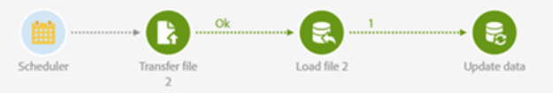

# ACS의 파일 수집기 활동 대체

## 설명

ACS에는 File Collector 활동이 없으므로 다음 활동을 사용하여 빌드할 수 있으며 동일한 기능을 하나 이상 사용할 수 있습니다

## 해상도

파일 전송 을 사용하면 외부 서버에서 파일 이름 패턴을 기반으로 여러 파일을 다운로드할 수 있습니다. 각 파일이 파일 로드 활동에 전달되어 업데이트에 데이터를 제공합니다.
완료되면 다음 파일 등으로 계속 진행합니다.
파일 전송에는 파일 수집기에서 알 수 있는 기록 설정도 있습니다.
이 예제는 다운로드에서 네 개의 파일을 처리하여 스키마에 데이터를 삽입하는 워크플로우 실행 로그의 예입니다.

log;날짜;활동 이름;메시지 워크플로우가 완료된 작성기1;1/1 레코드 처리(단계 &#39;데이터 업데이트&#39;) writer1; 0개의 레코드 &#39;데이터 업데이트&#39; 단계(writer1) 삽입: 1개의 레코드 업데이트(&#39;데이터 업데이트&#39; 단계) writer1; 0개의 레코드가 변경되지 않음(&#39;데이터 업데이트&#39; 단계) writer1;1/1개의 레코드가 처리됨(단계 &#39;데이터 업데이트&#39;) writer1; 0개의 레코드 &#39;데이터 업데이트&#39; 단계(writer1) 삽입: 1개의 레코드 업데이트(&#39;데이터 업데이트&#39; 단계) writer1; 0개의 레코드가 변경되지 않음(&#39;데이터 업데이트&#39; 단계) writer1;1/1개의 레코드가 처리됨(단계 &#39;데이터 업데이트&#39;) writer1; 0개의 레코드 &#39;데이터 업데이트&#39; 단계(writer1) 삽입: 1개의 레코드 업데이트(&#39;데이터 업데이트&#39; 단계) writer1; 0개의 레코드가 변경되지 않음(&#39;데이터 업데이트&#39; 단계) writer1;1/1개의 레코드가 처리됨(&#39;데이터 업데이트&#39; 단계);writer1;: 0개의 레코드 &#39;데이터 업데이트&#39; 단계(writer1) 삽입: 1개의 레코드 업데이트(&#39;데이터 업데이트&#39; 단계) writer1; 0개의 레코드(데이터 업데이트 단계) fileImport2;1개의 레코드(/usr/local/neolane/nl7/var/acs304_mkt_dev1/workflow/wf-WKF5/fileTransfer2/profiles_1_20191217205838a.csv&#39;(단계 &#39;파일 로드 2&#39; - 0이 무시됨) 파일Import2;파일 로드 시작(단계 &#39;/usr/local/neolane/nl7/var/acs304_mkt_dev1/workflow/wf-WKF5/fileTransfer2/profiles_1_20191217205838a.csv&#39;)데이터베이스(단계 &#39;파일 로드 2&#39;) 파일 가져오기2;1개의 레코드(파일 로드 2&#39; - 0이 무시됨) 파일Import2;데이터베이스(단계 &#39;파일 로드 2&#39; - 0이 무시됨)로 파일 로드 시작(단계 &#39;/usr/local/neolane/nl7/var/acs304_mkt_dev1/workflow/wf-WKF5/fileTransfer2/profiles_2_20191217205837a.csv&#39;)파일 로드 시작(단계 &#39;파일 로드 2&#39;)&#39;) 파일 로드(/usr/local/neolane/nl7/var/acs304_mkt_dev1/workflow/wf-WKF5/fileTransfer2/profiles_3_20191217205836a.csv2단계에서 로드됨) - 0 무시됨) fileImport2;파일 &#39;/usr/local/neolane/nl7/var/acs304_mkt_dev1/workflow/wf-WKF5/fileTransfer2/profiles_3_20191217205836a.csv&#39;을 데이터베이스로 로드 시작(단계 &#39;파일 로드 2&#39;) 파일Import2;파일 &#39;/usr/local/neolane/nl7/var/acs304_mkt_dev1/workflow/wf-WKF5/fileTransfer2/profiles_4_20191217205836a.csv&#39;에서 로드된 레코드 1개(단계 &#39;파일 로드 2&#39; - 0 무시됨) 파일Import2;파일 로드 시작 &#39;/usr/local/neolane/nl7/var/acs304_mkt_dev1/workflow/wf-WKF5/fileTransfer2/profiles_4_20191217205836a.csv&#39;을 데이터베이스로(단계 &#39;파일 로드 2&#39;) 파일Transfer2;파일 전송 시작~/testfiles/profiles_1.csv&#39; - &#39;profiles_1_20191217205838a.csv&#39; 파일Transfer2; &#39;sftp://ftp.omniture.com/&#39; 전송 시작~/testfiles/profiles_2.csv&#39; - &#39;profiles_2_20191217205837a.csv&#39; 파일Transfer2;sftp://ftp.omniture.com/ 전송 시작~/testfiles/profiles_3.csv&#39; - &#39;profiles_3_20191217205836a.csv&#39; 파일Transfer2; &#39;sftp://ftp.omniture.com/&#39; 전송 시작~/testfiles/profiles_4.csv&#39; - &#39;profiles_4_20191217205836a.csv&#39; 파일Transfer2;4개 파일(파일 전송);Transfer2;시작 파일 목록 &#39;sftp://ftp.omniture.com/testfiles/profiles_\*
