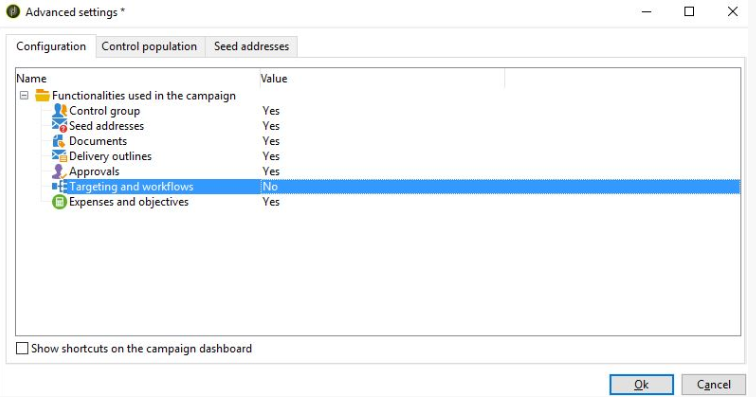

# 캠페인에서 타겟팅 및 워크플로우 탭을 볼 수 없음 | Campaign Classic

캠페인에 사용된 기능을 활성화하여 Campaign Classic에서 타겟팅 및 워크플로우 탭을 보는 방법에 대해 알아봅니다.

## 설명 {#description}

<b>환경</b>

Adobe Campaign Classic

<b>문제/증상</b>

캠페인에 &quot;타겟팅 및 워크플로우&quot; 탭이 표시되지 않습니다. 예:
   

## 해결 방법 {#resolution}

이 문제는 캠페인 템플릿 속성 &quot;캠페인에서 사용된 기능&quot; 아래의 옵션이 활성화되지 않았기 때문에 발생합니다. 이 문제를 해결하려면 -

- 캠페인과 연계된 캠페인 템플릿을 확인합니다.
- 캠페인 템플릿을 엽니다.
- 다음으로 이동 <b>편집</b>을 클릭한 다음 을 클릭합니다 <b>고급 캠페인 매개변수</b>.
- 아래 <b>구성, s</b>타겟팅 및 워크플로에 대해 값을 예로 선택합니다.

