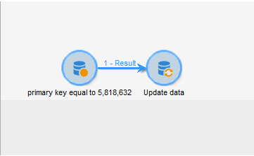

# WebApp을 삭제할 수 없습니다. 오류: 키 값이 고유 제약 조건 &quot;xtkdictionarystring_name&quot;을 위반합니다.

## 설명

WebApp을 삭제할 수 없는 경우가 있으며 다음 오류 PGS-220000 PostgreSQL 오류가 발생할 수 있습니다. 오류: 중복된 키 값이 고유한 제약 조건 &quot;xtkdictionarystring_name&quot;을 위반합니다.

세부 사항: 키(iobjectid, sourceid, locale) = (0, del_5818632_closedFormLog, en)가 이미 있습니다.

## 해상도

더 이상 필요하지 않은 웹 앱을 삭제하는 동안 ACC에서 이 오류가 발생하면 워크플로우를 통해 webApp을 삭제하는 것이 해결됩니다(아래 표시)

- 새 워크플로우를 만들고 캔버스에서 쿼리를 삭제하고 활동을 업데이트합니다.

- 웹 앱의 기본 키를 쿼리하고 데이터 업데이트 활동에서 삭제로 작업 유형을 업데이트합니다. 앱이 삭제되면 데이터베이스 복원이 완료되지 않으면 검색할 수 없습니다.

