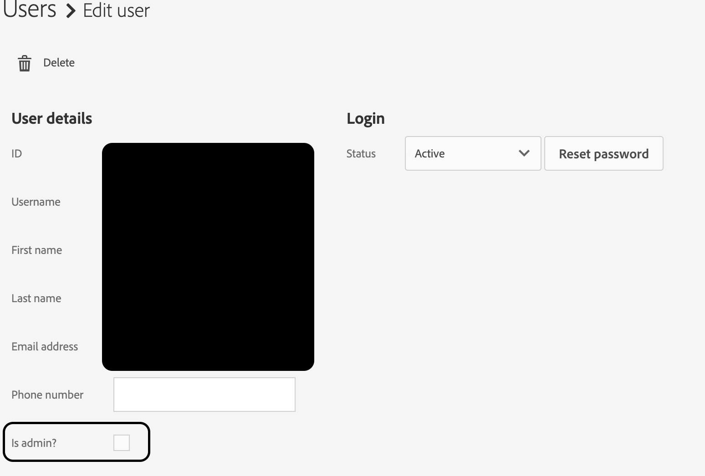

# Adobe Audience Manager의 액세스 문제

## 설명

Admin Console을 통해 액세스 권한이 부여되더라도 Audience Manager에 액세스 문제가 있습니까? 이 단계를 수행하면 도움이 됩니다.

## 해상도

AAM 시스템 관리자는 Audience Manager UI 자체(Admin Console 아님) 내에서 이러한 단계를 완료하여 Audience Manager UI 내에서 모든 문제 제기된 관리자 권한을 부여할 수 있습니다. RBAC 컨트롤을 사용하여 더 세부적인 권한을 부여할 수도 있습니다. RBAC에 대한 자세한 내용은 여기에서 확인할 수 있습니다. [https://experienceleague.adobe.com/docs/audience-manager/user-guide/features/administration/administration-overview.html?lang=en](https://experienceleague.adobe.com/docs/audience-manager/user-guide/features/administration/administration-overview.html?lang=ko-KR)

<b>AAM 시스템 관리자 권한을 부여하는 절차</b>

1. 다음으로 이동 [!UICONTROL 관리] > [!UICONTROL 사용자]

   

1. 해당 사용자 계정을 찾아 &quot;[!UICONTROL 관리자입니까?]&quot; 전체 AAM 권한을 부여하는 확인란

   
