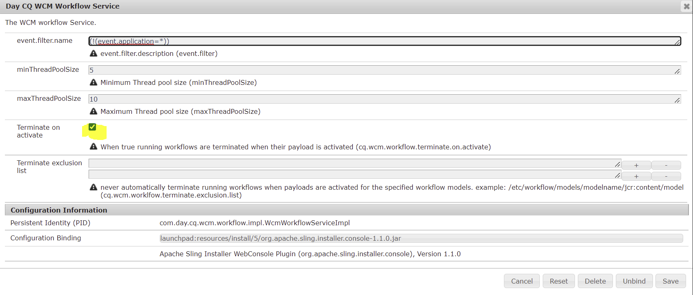

# 예약된 게시 워크플로우의 자동 종료 방지

## 설명 {#description}

<b>환경</b>

Adobe Experience Manager as a Cloud Service

<b>문제/증상</b>

페이로드의 에셋이 수동으로 게시되는 경우 예약된 게시 워크플로우의 자동 종료를 방지하는 방법

<b>복제 단계</b>

1. AEM Sites에서 게시되지 않은 자산(이미지)이 있는 페이지를 선택합니다.
2. 게시 관리를 클릭합니다.
3. 나중에 선택&quot; 미래 날짜 선택
4. Click Next&quot; 페이지 선택
5. 다음&quot; 워크플로우 제목 입력(예: 나중에 게시)을 클릭합니다.
6. 이제 도구&quot; 워크플로&quot; 인스턴스로 이동
7. 나중에 활성화하도록 예약한 작업을 &quot;나중에 게시&quot;라는 제목으로 찾을 수 있습니다.
8. Select the Job&quot; Click Payload
9. 활성화가 예약된 페이지 및 자산을 찾을 수 있는 새 탭이 열립니다.
10. 이제 페이로드에 있는 자산을 수동으로 활성화합니다.
11. 이제 도구&quot; 워크플로&quot; 아카이브로 이동
12. &quot;예약된 워크플로우&quot;(나중에 게시) 작업이 중단됨 상태가 됩니다.

## 해결 방법 {#resolution}

예약된 게시의 자동 종료를 비활성화하려면 OSGi 구성에서 &quot;Day CQ WCM Workflow Service&quot; 아래의 &quot;Terminate on published&quot; 옵션( 스크린샷 참조)을 &quot;선택 취소&quot;하십시오.

