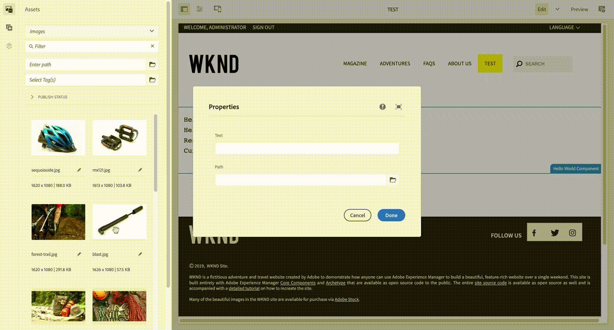

# Adobe Experience Manager: 자산을 PathField에 드래그하여 놓는 방법을 사용합니다.

## 설명


AEM 6.5.10에서 자산 브라우저의 자산을 페이지 편집기의 경로 필드로 끌어다 놓을 수 있습니다.
이 문서에서는 이 기능을 활성화하는 방법을 설명합니다.



이 기능은 AEM 6.5.10 릴리스 노트의 아래 줄에 해당합니다.
https://experienceleague.adobe.com/docs/experience-manager-65/release-notes/service-pack/6.5.10.html?lang=en

- 의 PathField [!DNL Sites] 편집기를 사용하면 작성자가 콘텐츠 파인더에서 자산을 드래그할 수 있습니다.


<b>환경</b>
AEM as a Cloud Service, AEM 6.5.10 이상


## 해상도


추가 `droppable` PathField의 노드에 대한 속성입니다.

```
  name: droppable
  type: Boolean
  value: true
```

사용자 지정 예 `droppable=true`와 함께 WKND 자습서의 HelloWorld 구성 요소에 추가되었습니다. `/apps/wknd/components/helloworld/cq:dialog/content/items/column/items/path: `


```
?xml version="1.0" encoding="UTF-8"?
    jcr:root xmlns:sling="http://sling.apache.org/jcr/sling/1.0" xmlns:cq="http://www.day.com/jcr/cq/1.0" xmlns:jcr="http://www.jcp.org/jcr/1.0" xmlns:nt="http://www.jcp.org/jcr/nt/1.0"
        jcr:primaryType="nt:unstructured"
        jcr:title="Properties"
        sling:resourceType="cq/gui/components/authoring/dialog"
        content
            jcr:primaryType="nt:unstructured"
            sling:resourceType="granite/ui/components/coral/foundation/fixedcolumns"
            items jcr:primaryType="nt:unstructured"
                column
                    jcr:primaryType="nt:unstructured"
                    sling:resourceType="granite/ui/components/coral/foundation/container"
                    items jcr:primaryType="nt:unstructured"
                        text
                            jcr:primaryType="nt:unstructured"
                            sling:resourceType="granite/ui/components/coral/foundation/form/textfield"
                            fieldLabel="Text"
                            name="./text"/
                        path
                            jcr:primaryType="nt:unstructured"
                            sling:resourceType="granite/ui/components/coral/foundation/form/pathfield"
                            fieldLabel="Path"
                            droppable="{Boolean}true"
                            name="./path"/
                    /items
                /column
            /items
        /content
    /jcr:root
```
