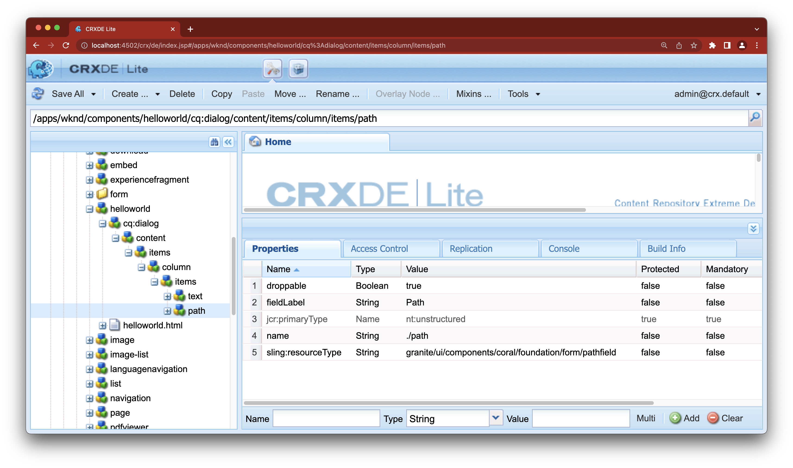

# PathField에서 에셋 드래그 앤 드롭 기능을 활성화하는 방법


Adobe Experience Manager 6.5.10 업데이트 후 에셋 브라우저의 에셋을 페이지 편집기의 PathField로 드래그 앤 드롭할 수 있습니다. 이 기능을 사용하려면 *배설물* 속성을 PathField의 노드에 추가합니다.

## 설명 {#description}


### 환경

Adobe Experience Manager

### 문제/증상

AEM 6.5.10 이상에서 에셋 브라우저의 에셋을 페이지 편집기의 PathField로 드래그 앤 드롭할 수 있습니다. 이 기능은 의 아래 줄에 해당합니다. [AEM 6.5.10 릴리스 노트](https://experienceleague.adobe.com/docs/experience-manager-65/content/release-notes/service-pack/6-5-10.html?lang=en):

*사이트 편집기의 PathField를 사용하여 콘텐츠 파인더에서 에셋을 드래그할 수 있습니다.*

이 문서에서는 이 기능을 활성화하는 방법에 대해 설명합니다.


## 해결 방법 {#resolution}


추가 *배설물* 속성을 PathField의 노드에 추가합니다.


```
name: droppable

  type: Boolean

  value: true
```


<b>사용자 정의 예:</b>

이 있는 PathField `droppable=true`가 WKND 자습서의 HelloWorld 구성 요소에 로 추가되었습니다.

`/apps/wknd/components/helloworld/cq:dialog/content/items/column/items/path/@dropable={Boolean}true`




```
<?xml version="1.0" encoding="UTF-8"?>
    <jcr:root xmlns:sling="http://sling.apache.org/jcr/sling/1.0" xmlns:cq="http://www.day.com/jcr/cq/1.0" xmlns:jcr="http://www.jcp.org/jcr/1.0" xmlns:nt="http://www.jcp.org/jcr/nt/1.0"
        jcr:primaryType="nt:unstructured"
        jcr:title="Properties"
        sling:resourceType="cq/gui/components/authoring/dialog">
        <content
            jcr:primaryType="nt:unstructured"
            sling:resourceType="granite/ui/components/coral/foundation/fixedcolumns">
            <items jcr:primaryType="nt:unstructured">
                <column
                    jcr:primaryType="nt:unstructured"
                    sling:resourceType="granite/ui/components/coral/foundation/container">
                    <items jcr:primaryType="nt:unstructured">
                        <text
                            jcr:primaryType="nt:unstructured"
                            sling:resourceType="granite/ui/components/coral/foundation/form/textfield"
                            fieldLabel="Text"
                            name="./text"/>
                        <path
                            jcr:primaryType="nt:unstructured"
                            sling:resourceType="granite/ui/components/coral/foundation/form/pathfield"
                            fieldLabel="Path"
                            droppable="{Boolean}true"
                            name="./path"/>
                    </items>
                </column>
            </items>
        </content>
    </jcr:root>
```

