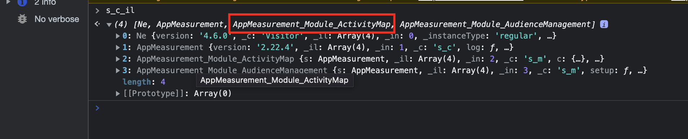

# Active Map 데이터 수집을 비활성화하는 방법

## 설명

어떤 이유로 Active Map 데이터를 더 이상 수집하지 않습니다. Active Map 데이터 수집을 비활성화하려면 어떻게 해야 합니까?
  

## 해상도

- <b>Adobe Analytics 라이브러리가 고객 서버에서 관리되는 경우(AppMeasurement.js 자체 호스팅 )</b>

AppMeasurement.js 파일에서 AppMeasurement_Module_ActivityMap 모듈을 삭제합니다

- <b>Adobe Analytics 라이브러리가 Adobe 측에서 관리되는 경우( Adobe CDN을 통해 호스팅된 AppMeasurement.js)</b>

AEP 데이터 수집(Launch) UI에서 Adobe Analytics 확장의 구성으로 이동한 후 상자를 선택 취소하여 Activity Map을 비활성화한 다음 빌드를 게시합니다

- 

- <b>Active Map을 비활성화한 후에는 &#39;s_c_il&#39; 명령으로 브라우저 &#39;console&#39; 메뉴를 통해 Active Map 모듈이 로드되지 않았는지 확인합니다</b>

활성 맵 모듈이 로드되었습니다.

활성 맵 모듈이 로드되지 않았습니다.

- <b>Active Map을 비활성화한 후 브라우저 &#39;네트워크&#39; 메뉴를 통해 Adobe Analytics 서버 호출을 확인하십시오</b>.

