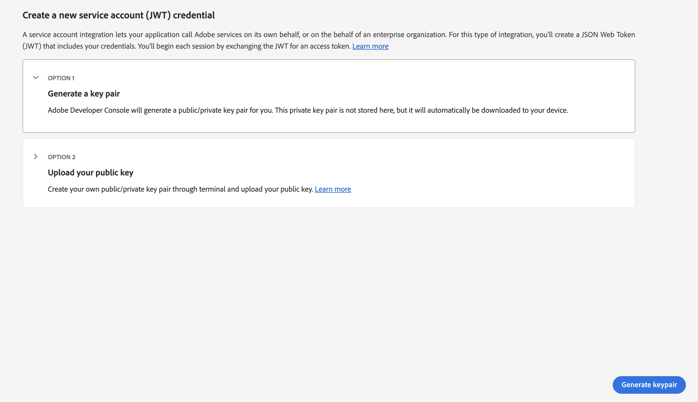
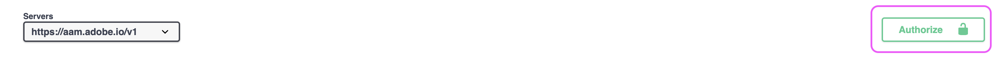

# AAM API 액세스를 설정하는 방법

개발자 콘솔에서 프로젝트를 만들어 Audience Manager API JWT 자격 증명을 생성하는 방법을 알아봅니다.

## 설명 {#description}

### 환경

Adobe Audience Manager

### 문제/증상

Audience Manager API에 대한 자격 증명을 설정하고 생성하는 방법

## 해결 방법 {#resolution}

Audience Manager API에 대한 자격 증명을 생성하려면 Admin Console에서 시스템 관리자 권한이 필요합니다. 1~2단계에서는 이러한 에스컬레이션된 권한을 부여하는 방법을 간략하게 설명합니다. 현재 시스템 관리자는 추가 사용자에게 에스컬레이트된 관리자 권한을 부여하는 것보다 이러한 단계를 직접 수행하는 것이 더 나을 수 있습니다. 이 경우 3단계로 바로 건너뜁니다.

1. 다음 위치로 이동 [Admin Console](https://adminconsole.adobe.com/) 을 클릭하고, &quot;빠른 링크&quot; 메뉴에서 &quot;관리자 추가&quot;를 선택합니다.     
2. 액세스 권한을 부여할 모든 사용자의 이메일을 입력합니다. 다음 페이지에서 권한 수준에 대해 &quot;시스템 관리자&quot;를 선택합니다.     
3. 다음으로 이동 [https://developer.adobe.com/console](https://developer.adobe.com/console) . 이전 단계에서 시스템 관리자 권한이 부여되었음에도 불구하고 아직 액세스 권한이 없는 경우 쿠키/캐시를 새로 고침해 보십시오.
4. 빠른 시작 메뉴(또는 위쪽 탐색의 프로젝트 메뉴)에서 새 프로젝트를 만듭니다.     
5. 프로젝트에 Audience Manager API 추가:     
   
6. 단계에 따라 JWT 자격 증명을 생성(또는 업로드)합니다. 개발 콘솔을 통해 자격 증명을 생성하도록 선택하는 경우 개인 키를 안전하게 저장해야 합니다. 이후 단계에서 개인 키가 필요합니다.     
7. 그런 다음 관련 제품 프로필에 자격 증명을 할당하라는 메시지가 표시됩니다. 조직에서 역할 기반 액세스 제어를 사용하는 경우 다음 단계에 따라 기술 사용자 계정을 만들고 관련 RBAC 그룹에 해당 계정을 추가해야 합니다. [https://experienceleague.adobe.com/docs/audience-manager/user-guide/api-and-sdk-code/rest-apis/aam-api-getting-started.html?lang=en#technical-account-rbac-permissions](https://experienceleague.adobe.com/docs/audience-manager/user-guide/api-and-sdk-code/rest-apis/aam-api-getting-started.html?lang=en#technical-account-rbac-permissions)
8. 이러한 단계가 완료되면 액세스 토큰을 생성하여 첫 번째 API 요청을 수행할 수 있습니다. 먼저 개발 콘솔에서 자격 증명 개요 페이지를 클릭합니다.     
9. 페이지 상단에 있는 &quot;JWT 생성&quot; 탭을 클릭하고, 6단계에서 다운로드한 파일의 전체 개인 키에 붙여넣은 다음 &quot;토큰 생성&quot;을 클릭합니다.     

마지막으로, 이전 단계에서 검색된 액세스 토큰을 활용하여 API 요청을 수행할 수 있습니다. 호출은 cURL 명령을 통해 직접 Postman과 같은 모든 API 플랫폼에서 또는 API 설명서 페이지에서 수행할 수도 있습니다. [https://bank.demdex.com/portal/swagger/index.html#/](https://bank.demdex.com/portal/swagger/index.html#/)

설명서의 데모 기능을 사용하여 호출하려면 위의 단계에 따라 토큰을 생성한 다음 페이지 오른쪽의 &quot;승인&quot;을 클릭하고 토큰을 입력하십시오.

또한 위의 스크린샷에 표시된 대로 aam.adobe.io 서버를 선택해야 합니다. 이제 관련 매개 변수를 입력하고 &#39;사용해 보기&#39; 버튼을 클릭하여 API 요청에 데모 기능을 활용할 수 있습니다.

이렇게 하면 실제 API 요청이 인스턴스로 전송됩니다. DELETE, PUT 또는 POST 요청을 활용하는 경우 인스턴스에 의도하지 않은 변경이 발생할 수 있습니다. 요청을 보내기 전에 항상 이러한 각 API 호출에 대한 설명서를 주의 깊게 읽어야 합니다.
