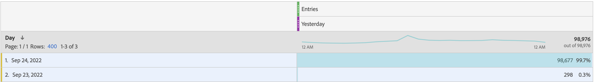

# 시작 지표 예약된 보고서가 보고 창의 외부를 포함합니다

## 설명

<b>문제:
  </b>
 예약된 항목 지표 보고서에는 보고 기간을 벗어나는 데이터가 포함됩니다.
 아래 이미지와 같이 보고서 창은 &quot;어제&quot;이지만, 예약된 보고서에는 어제의 (9월 24일) 데이터뿐만 아니라 다른 날짜의 데이터도 포함됩니다.
 예약된 보고서에 어제의 데이터만 포함하는 이유와 방법은 무엇입니까?
  
  
 

## 해상도

<b>이유:</b>
시작 이 방문 기반 지표이므로.
시작 및 바운스 비율과 같은 방문 기반 지표는 보고 기간 시작 날짜 범위 전날 데이터를 지정할 수 있습니다. 이 속성의 가장 일반적인 시나리오는 방문이 자정에 걸쳐 있는 경우입니다. 예:

1. 9월 23일 오후 11시 50분에 한 사용자가 홈페이지를 방문했다.
2. 몇 페이지를 방문한 후, 사용자는 9월 24일 오전 12시 10분에 홈페이지를 떠났다.

이 예에서 &quot;보고서 창&quot;이 9월 24일(어제)이면 이 방문은 보고서에 포함됩니다. 
하지만 항목 지표는 9월 23일에 기여하므로 &quot;2022년 9월 23일&quot; Dimension도 보고서에 표시됩니다.
 
<b>솔루션:</b>
Work As Design이지만, 해결 방법으로 행 수를 1로 설정하고, 일 차원을 적절하게 정렬한 다음, 보고서를 저장 및 다시 예약할 수 있습니다. 아래 이미지와 같이 &quot;어제&quot; 데이터만 포함하는 보고서를 받을 수 있습니다.
 

