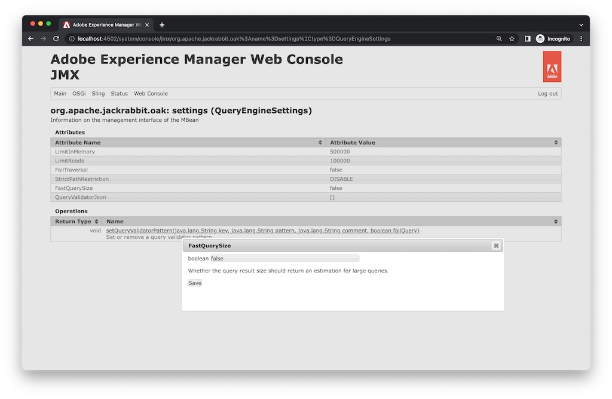

# 히트 수가 잘못된 것 같은 경우 구성을 확인하는 방법

구성 방법 알아보기 `fastQuerySize` 쿼리의 실제 검색 결과 수가 히트 수와 다른 경우 옵션입니다. 을 활성화하는 방법에는 여러 가지가 있습니다. `fastQuerySize` 옵션을 선택합니다. 이 문서에서는 각 방법을 구성하는 방법을 설명합니다.

## 설명 {#description}

### <b>환경</b>

AEM(Adobe Experience Manager)

### <b>문제/증상</b>

히트 수가 잘못된 것 같은 경우 구성을 확인하는 방법

## 해결 방법 {#resolution}

<b>OSGi 구성</b>:Web Console > 구성 > Apache Jackrabbit Query Engine 설정 서비스 > 빠른 결과 크기

`http://localhost:4502/system/console/configMgr/org.apache.jackrabbit.oak.query.QueryEngineSettingsService`
    확인 <b>빠른 결과 크기</b> 저장.
   

<b>Java 구성</b>:`-Doak.fastQuerySize=true`

AEM 시작 스크립트(crx-quickstart/bin/start)에서 아래 시스템 속성을 추가합니다.
        `CQ_JVM_OPTS="${CQ_JVM_OPTS} -Doak.fastQuerySize=true"`

이 구성은 OSGi 구성을 무시합니다.
    

<b>JMX</b>:Web Console > JMX > org.apache.jackrabbit.oak: 설정(QueryEngineSettings)

`http://localhost:4502/system/console/jmx/org.apache.jackrabbit.oak%3Aname%3Dsettings%2Ctype%3DQueryEngineSettings`
    변경 <b>빠른 결과 크기</b> 끝 *true* 및 <b>저장</b>.

JMX의 이 구성 값은 다른 구성을 재정의합니다. AEM을 다시 시작하면 값이 재설정됩니다.

