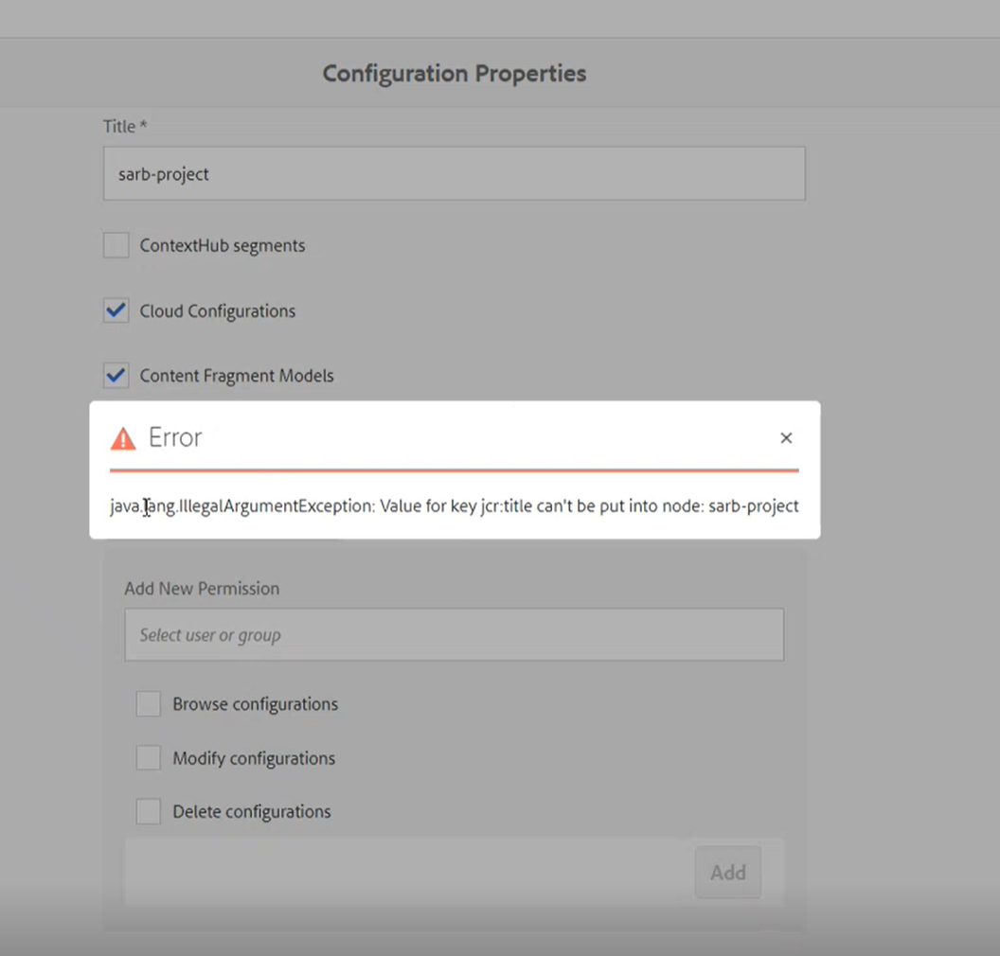

# 콘텐츠 조각에 대한 클라우드 구성 설정에서 AEM 프로젝트 경로를 찾을 수 없음

## 설명 {#description}

<b>환경</b>

- Adobe Experience Manager

<b>문제/증상</b>

1. 도구 / 에셋에서 콘텐츠 조각 모델을 생성했습니다.
2. 자산 / 파일 / 프로젝트 이름 / 조각 폴더를 생성함 로 이동합니다.
3. 조각 폴더 내에서 콘텐츠 조각을 만들어 기본 조각만 표시됩니다(단순 조각).
4. AEM 설명서에 따라 한 단계 뒤로 이동하여 폴더를 선택합니다.
5. 경로를 선택하는 옵션에서 속성 / 클라우드 서비스 / 클라우드 구성 을 클릭합니다.
6. WKND 또는 we.retail과 같은 모든 기본 프로젝트를 볼 수 있지만 콘텐츠 조각을 만들기 위해 모델로 이동할 프로젝트 이름을 찾을 수 없습니다.
7. 구성을 수정하려고 할 때 다음 오류가 발생했습니다.*java.lang.IllegalArgumentException: 키 jcr:title의 값을 노드에 입력할 수 없습니다.*

  (다음을 참조하십시오. [구성 및 구성 브라우저](https://experienceleague.adobe.com/docs/experience-manager-65/administering/introduction/configurations.html?lang=en) 관리 사용 안내서에서)   

## 해결 방법 {#resolution}

CRXDE에서 노드 이름을 바꾸고 동일한 이름의 새 노드를 만든 다음 속성을 복사합니다.

<b>원인</b>

문제는 노드가 `/conf` 다음 포함: `jcr:primaryTyp `속성이 로 설정됨 *nt:folder*, 대신 `sling:Folder`.
이 노드의 형식이 잘못되었으므로 구성 브라우저에서 올바른 경로로 선택되지 않습니다.
