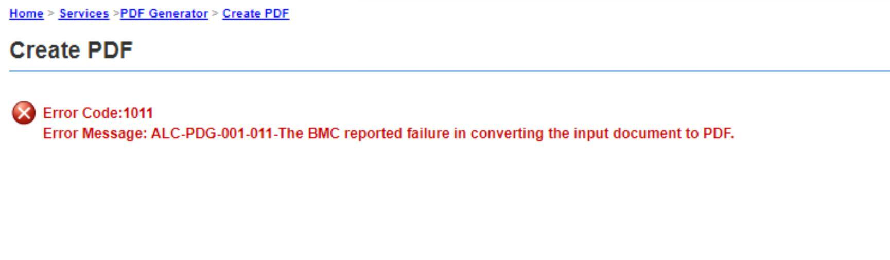

# Adobe Experience Manager Forms: JPEG 2000으로 PDF Generator 오류 해결 방법

## 설명 {#description}


PDF Generator는 다음 오류가 발생하면 Acrobat 2020 Classic의 Windows Server에서 JPEG 2000 양식 에셋(JPF, JPX, JP2, J2K, J2C, JPC)을 처리할 수 없습니다.


```
Error Code:1011 
Error Message: ALC-PDG-001-011-The BMC reported failure in converting the input document to PDF.
```


이 문서에서는 이 문제를 해결하는 방법에 대해 설명합니다.

예제 로그:
server.log


```
01:23:45,678 ERROR com.adobe.aes.web.create.CreatePDFAct (default task-15) ALC-PDG-001-000-Invocation error.: ALC-DSC-003-000: com.adobe.idp.dsc.DSCInvocationException: Invocation error.
    at com.adobe.idp.dsc.component.impl.DefaultPOJOInvokerImpl.invoke(DefaultPOJOInvokerImpl.java:152) adobe-dscf-client.jar:6.5.0.0.20220523.bee76832
    at.
...
Caused by: ALC-PDG-1011-000: com.adobe.livecycle.generatepdf.client.ConversionException: ALC-PDG-001-011-The BMC reported failure in converting the input document to PDF.
    at com.adobe.pdfg.BMCCaller.checkResult(BMCCaller.java:405)
    at com.adobe.pdfg.Native2PdfCaller.callNativeBMC(Native2PdfCaller.java:1229)
    at com.adobe.pdfg.Native2PdfCaller.createPDF(Native2PdfCaller.java:420)
    at com.adobe.pdfg.GeneratePDFImpl.createPDFInternal(GeneratePDFImpl.java:527)
    at com.adobe.pdfg.GeneratePDFImpl.createPDFCommon(GeneratePDFImpl.java:366)
    at com.adobe.pdfg.GeneratePDFImpl.createPDF(GeneratePDFImpl.java:307)
    at sun.reflect.NativeMethodAccessorImpl.invoke0(Native Method) rt.jar:1.8.0_181
    at sun.reflect.NativeMethodAccessorImpl.invoke(NativeMethodAccessorImpl.java:62) rt.jar:1.8.0_181
    at sun.reflect.DelegatingMethodAccessorImpl.invoke(DelegatingMethodAccessorImpl.java:43) rt.jar:1.8.0_181
    at java.lang.reflect.Method.invoke(Method.java:498) rt.jar:1.8.0_181
    at com.adobe.idp.dsc.component.impl.DefaultPOJOInvokerImpl.invoke(DefaultPOJOInvokerImpl.java:118) adobe-dscf-client.jar:6.5.0.0.20220523.bee76832
    ... 207 more
```




<b>환경</b>

JEE
Acrobat 2020 Classic
Microsoft Windows Server 2019의 AEM 6.5 양식


## 해상도 {#resolution}


Acrobat의 레지스트리 항목을 설정합니다.

1. AEM Forms가 실행 중인 Windows Server에서 레지스트리 편집기 열기

2. 아래 경로 선택
HKEY_CURRENT_USER\SOFTWARE\Adobe\Adobe Acrobat\DC\ImageConversionPlugin

3. 새 키 생성(buseSandbox가 있는 경우 데이터만 변경)

이름: buseSandbox
유형: REG_DWORD(32비트) 값
데이터: 0

PDF Generator에서 “PDF 만들기”를 다시 실행하고 PDF가 생성되었는지 확인합니다.
