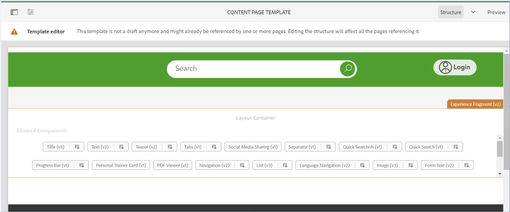

# 새 배포가 모든 스타일을 제거합니다.

## 설명 {#description}

한 환경에서 파이프라인을 배포한 후 고객은 템플릿의 사용자 지정 스타일 및 그 결과로 해당 템플릿으로 만든 페이지의 스타일이 제거되었음을 알게 됩니다.

그림 1. 스타일이 있는 템플릿

그림 2. 스타일이 없는 템플릿

## 해상도 {#resolution}

고객이 해당 환경 내에 배포했던 프로젝트를 확인하면 배포된 분기 아래의 filter.xml 파일에 컨텐츠 1이 있다는 것을 발견했습니다.
수정된 템플릿이 들어 있는 &quot;/conf/path/settings/wcm/templates/modified_template&quot; 경로에는 &quot;replace&quot;를 의미하는 기본 필터 모드가 있습니다.
즉, 고객이 파이프라인을 배포할 때마다 해당 경로가 배포된 프로젝트의 파이프라인으로 대체됩니다.
이 문제를 해결하려면 다른 경로처럼 필터 모드를 &quot;병합&quot;으로 설정해야 합니다.

1 workspaceFilter 버전=&quot;1.0&quot; 필터 루트=&quot;conf/path/settings/wcm/templates/modified_template&quot;/ 필터 루트=&quot;merge&quot;/conf/path&quot; mode=&quot;merge&quot;/ filter root=&quot;merge&quot;/conf/path2&quot; mode=&quot;merge&quot;/filter root=&quot;merge&quot;/content/path2&quot; mode=&quot;merge&quot;/ filter root=&quot;/content/dam/path2/asset.jpg&quot; mode=&quot;merge&quot;/ filter root=&quot;content/experience-fragments/path2&quot; mode=&quot;merge&quot;/ /workspaceFilter
