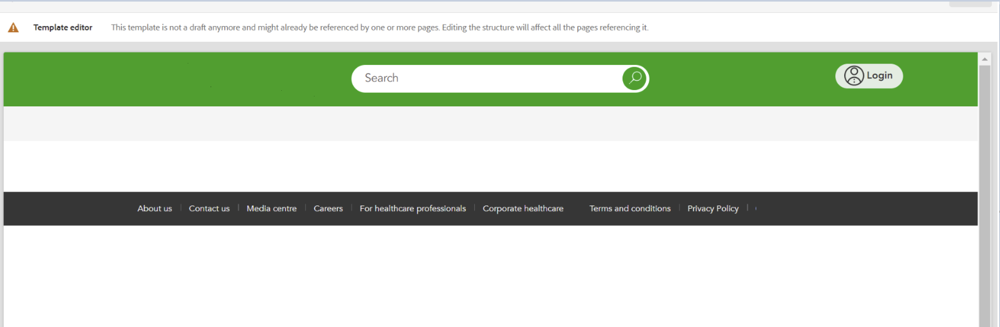

# 새 배포로 인해 모든 스타일이 제거됨 | AEM


Adobe Experience Manager의 특정 환경에 파이프라인을 배포한 후 템플릿에서 사용자 정의 스타일이 제거되어 관련 페이지에서 스타일이 손실되는 것을 발견했습니다. 다음을 설정하십시오. <b>필터</b> 모드: *병합*.

## 설명 {#description}


### <b>환경</b>

Adobe Experience Manager


### <b>문제/증상</b>

파이프라인을 하나의 환경에 배포하고 나서 템플릿의 사용자 정의 스타일과 그 결과 해당 템플릿으로 만든 페이지의 스타일이 제거되었음을 알게 되었습니다.


그림 1. 스타일이 있는 템플릿입니다.




그림 2. 스타일이 없는 템플릿입니다.


## 해결 방법 {#resolution}


고객이 환경에 배포한 프로젝트를 검토하고 나서 `filter.xml` 컨텐츠 변경을 담당하는 분기 아래에 있는 파일(이 예에서는 다음과 같음) `[` 1`]`  - 필터를 포함했습니다. `[` 2`]` .
배포 위치 다음의 수정된 템플릿 `/conf/path>/settings/wcm/templates/modified template>`, 하지만 기본적으로 다음과 같은 필터 모드는 없었습니다. *replace*.
이는 파이프라인이 배포될 때마다 코드의 경로가 대신 사용됨을 의미합니다.
필터 모드를 로 설정하여 이를 해결해야 합니다. *병합* 다른 경로에서와 마찬가지로 `[` 3`]` .

`[` 1`]`


```
/aem-<cust>-project.all-0.0.1-SNAPSHOT/jcr_root/apps/<cust>-packages/content/install/aem-<cust>-project.ui.content-0.0.1-SNAPSHOT/META-INF/vault/filter.xml
```


`[` 2`]`


```
<?xml version="1.0" encoding="UTF-8"?>
<workspaceFilter version="1.0">
    <filter root="/conf/<path>/settings/wcm/templates/<modified_template>"/>
    <filter root="/conf/<path>" mode="merge"/>
    <filter root="/conf/<path2>" mode="merge"/>
    <filter root="/content/<path2>" mode="merge"/>
    <filter root="/content/dam/<path2>/asset.jpg" mode="merge"/>
    <filter root="/content/experience-fragments/<path2>" mode="merge"/>
</workspaceFilter>
```


`[` 3`]`


```
<?xml version="1.0" encoding="UTF-8"?>
<workspaceFilter version="1.0">
    <filter root="/conf/<path>/settings/wcm/templates/<modified_template>" mode="merge"/>
    <filter root="/conf/<path>" mode="merge"/>
    <filter root="/conf/<path2>" mode="merge"/>
    <filter root="/content/<path2>" mode="merge"/>
    <filter root="/content/dam/<path2>/asset.jpg" mode="merge"/>
    <filter root="/content/experience-fragments/<path2>" mode="merge"/>
</workspaceFilter>
```


