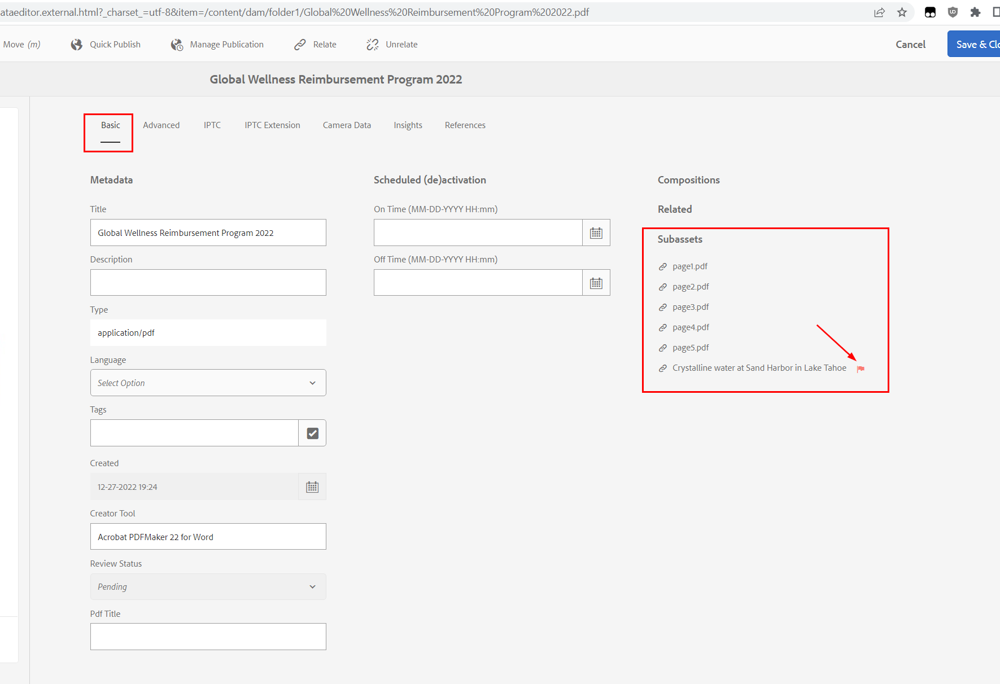

# 에셋에 표시되는 SUB-ASSET 상태

## 설명 {#description}

<b>환경</b>
- Experience Manager
- Experience Manager 6.5

<b>문제/증상</b>
에셋을 검색하는 동안 일부 에셋에 “SUB-ASSET” 상태가 표시됩니다.

어떤 의미입니까?

## 해결 방법 {#resolution}

<b>*SUB-ASSET</b>* 상태는 에셋에 *Digital Rights Management* 날짜가 만료된 몇몇 <b>관련 에셋</b>이 포함된 경우에 해당합니다.

이는 기본 에셋 자체가 만료된 시나리오 중 특정 사례이며 여기에 문서화되어 있습니다.

[https://experienceleague.adobe.com/docs/experience-manager-65/assets/administer/drm.html?lang=ko#asset-expiration](https://experienceleague.adobe.com/docs/experience-manager-65/assets/administer/drm.html?lang=ko#asset-expiration)

해당 에셋의 속성 *기본* 탭을 열고 *빨간 깃발* 아이콘을 확인하여 만료된 관련 에셋을 확인할 수 있습니다.

문제가 되는 <b>관련 에셋</b>은 두 종류입니다.

<u><b>#1 - 에셋이 하위 페이지가 있는 PDF인 경우</b></u>

PDF에서 페이지를 추출하도록 “DAM 에셋 업데이트”를 수정한 경우 문서 페이지에 대한 하위 에셋이 생성됩니다.

추출된 각 페이지는 기본 에셋 아래 “/subassets”로 명명된 하위 노드/폴더에 저장된 에셋이며 *고급* 탭에 있는 DRM *만료* 날짜를 포함하는 메타데이터 속성을 포함합니다.

*만료* 날짜가 지나면 다음과 같이 표시됩니다.

- 이 하위 페이지/에셋의 <b>*만료됨</b>* 상태: 왼쪽 상단 레일을 사용하여 *콘텐츠 전용* 보기에서 *하위 에셋*&#x200B;으로 전환하여 기본 PDF 하위 에셋을 탐색하는 경우
- <b>*SUB-ASSET</b>* 상태: 기본 PDF로 다시 이동하는 경우

다음 0페이지에 설명되어 있습니다.

<u><b>#2 - 에셋에 참조 에셋이 포함된 경우</b></u>

모든 유형의 에셋이 다른 에셋을 참조할 수 있습니다. <b>*SUB-ASSET</b>* 상태도 각 참조의 *만료* 날짜를 확인하여 계산됩니다.

이러한 참조는 속성에 저장됩니다.

`asset/jcr:content/related/links/sling:members/sling:resources`

<u>참고:</u>

에셋에 수천 개가 넘는 너무 많은 참조가 포함된 경우 에셋 속성을 표시하려고 할 때 일부 UI 성능 문제가 발생할 수 있습니다.

이러한 모든 참조의 상태를 확인/계산하는 데 너무 많은 시간이 소요될 수 있으며 속성 열기 요청 시간이 초과됩니다.

참조가 너무 많으면 성능 문제가 발생할 수 있으므로 조치가 필요합니다.

[https://jackrabbit.apache.org/oak/docs/dos_and_donts.html#Large_Multi_Value_Property](https://jackrabbit.apache.org/oak/docs/dos_and_donts.html#Large_Multi_Value_Property)

문제 해결을 위해 이들 관련 참조가 아무런 가치가 없는 경우 CRX/DE에서 다음 폴더/하위 노드를 삭제할 수 있습니다.

*/conten<b>t*`/.../asset/jcr:content/related/links`

<u><b>#3 - 만료된 에셋 확인 팁</b></u>

다음 JCR SQL2 쿼리를 사용하여 만료 날짜에 다다른 저장소의 모든 에셋을 나열할 수 있습니다.

`SELECT * FROM dam:Asset WHERE jcr:content/metadata/prism:expirationDate  cast('2023-01-02T17:00:00.000Z' as date)`

날짜를 현재 시간으로 변경합니다(GMT 형식).
