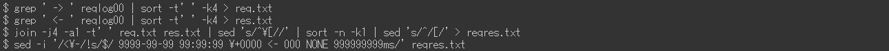

# Adobe Experience Manager: request.log 분석 예

## 설명 {#description}

AEM request.log에는 성능 문제를 분석할 때 응답 시간과 같은 다양한 유용한 정보가 포함되어 있습니다. 다음은 Linux 명령(일부 외부 명령 포함)을 사용하는 분석 예 목록입니다.

<b>환경</b>
AEM 6.5, Linux(Bash)

## 해결 방법 {#resolution}

목차:  
<b>소개</b>
  request.log 형식

<b>준비</b>
  1단계. 데이터 정리 2단계. 3단계를 다시 시작했습니다. 시간당 액세스 수 4단계 최대 동시 처리 단계 5. 로그 파일을 분할합니다. 6단계. 병합 요청 레코드 및 응답 레코드

<b>분석 예</b>
  예제 1. 가장 많은 액세스 권한은 예제 2입니다. 누락된 응답에 액세스합니다. 예 3. 느린 액세스 예 4. 응답 시간의 시계열 데이터 예 5. 최소, 평균(평균), 중간값, 최대 응답 시간 예 6. 기간별 액세스 수 예 7. 기간별 응답 상태 수 예 8. 가장 자주 사용하는 URL 예 9. request.log 레코드에 대한 access.log 레코드

<b>결론</b>

 소개  request.log 형식  
AEM 6.5는 기본적으로 다음 형식으로 request.log를 생성합니다. 시스템 제한 사항으로 인해 이 문서의 명령줄은 일반 텍스트 대신 이미지로 표시됩니다.

request.log의 예:

이 문서에서 &quot;-&quot;가 &quot;요청 레코드&quot;인 줄을 참조합니다. &quot;-&quot;가 있는 행은 &quot;응답 레코드&quot;입니다.

<b>요청 레코드</b>
  AEM에서 요청을 받으면 요청 레코드가 기록됩니다. 여기에는 수신 날짜 및 시간, 요청 ID, 요청 방법 및 URL이 포함되어 있습니다.

<b>응답 레코드</b>
  AEM이 요청에 응답하면 응답 레코드가 기록됩니다. 여기에는 응답 날짜 및 시간, 요청 ID, 상태 코드, 컨텐츠 유형 및 응답 시간(밀리초)이 포함되어 있습니다.

해당 설명서를 참조하십시오. https://experienceleague.adobe.com/docs/experience-manager-65/deploying/configuring/monitoring-and-maintaining.html?lang=en#interpreting-the-request-log

 준비  1단계. 데이터 정리  
request.log의 분석으로 이동하기 전에 로그 레코드를 표준화하는 것이 중요합니다.

상기 첫 번째 sed 명령은 컨텐츠 유형 응답 레코드의 추가 공간을 제거하여 공백이 잘못된 필드 분리를 방지한다. ruby 명령은 날짜 형식을 ISO 8601로 변환합니다. ruby 명령은 또한 콜론 대신 공백으로 날짜 및 시간을 구분합니다.

 2단계. 다시 시작한 시간  
AEM 및 서비스 팩 설치를 다시 시작하면 request.log의 요청 ID가 재설정됩니다. 요청 ID = 0인 요청 레코드는 다음과 같은 작업이 있을 수 있음을 나타냅니다.

위의 예에서 요청 ID는 13에서 0으로 재설정되었습니다:08:49と13:26:13.

 3단계. 시간당 액세스 수  
시간당 액세스 수 및 request.log의 시간 범위를 카운트합니다.

           
 4단계. 최대 동시 처리 수  
동시 처리 수는 AEM의 서버 로드를 예측하는 데 도움이 됩니다.

기본적으로 AEM의 Jetty에 대한 최대 동시 연결 수는 200개로 설정됩니다. 응답을 완료한 후 소켓 해제가 지연됩니다. 동시 처리 수가 약 170개를 초과하면 새 요청을 수락할 수 없습니다.

 5단계. 로그 파일 분할  
AEM이 다시 시작되거나 서비스 팩이 설치된 경우 request.log의 요청 ID가 재설정됩니다. 이러한 동작으로 인해 request.log에 이러한 작업이 포함되어 있으면 분석이 올바르지 않을 수 있습니다. 정확한 분석을 수행하고 한 번에 처리되는 파일 크기를 줄이려면 요청 ID = 0으로 요청 레코드를 사용하여 request.log를 분할합니다.

 6단계. 병합 요청 레코드 및 응답 레코드  
요청 ID로 요청 및 응답 레코드를 병합하면 성능 문제가 시작될 때 쉽게 찾을 수 있습니다. 이 병합된 로그 파일을 나중에 예제에서 사용합니다.

마지막 지정된 명령은 해당 응답 레코드가 없는 요청 레코드에 더미 응답을 추가합니다. 요청 레코드가 없는 응답 레코드가 있을 수도 있습니다. 하지만 그들은 일반적으로 조사를 위한 문제가 아니므로 무시할 수 있다.

병합된 로그 파일은 다음과 같습니다.

           
 분석 예  예제 1. 가장 많은 액세스  
응답 없이 액세스를 포함하여 응답 시간으로 병합된 로그 파일을 내림차순으로 정렬합니다.

              
 예 2. 누락된 응답에 액세스  
Extract는 더미 응답 시간을 사용하여 해당 응답 레코드가 없는 액세스에 액세스합니다.

응답 없이 액세스 수신 타이밍이 서버 로드 증가와 관련이 있는 경우 이러한 액세스에는 트리거된 성능 문제가 있을 수 있습니다.

                                
 예 3. 느린 액세스  
Extract 는 10초 이상 걸린 액세스입니다.

히트 수가 너무 많으면 grep 명령에서 0-9{5}을 0-9{6}로 바꾸고 100초 이상 걸린 액세스 범위를 좁힙니다.

 예 4. 응답 시간의 시계열 데이터  
데이터에서 타임스탬프 및 응답 시간만 추출하면 그래프를 만드는 데 유용합니다.

즉시 응답한 액세스를 생략하면 데이터가 더 효율적입니다. 다음 예제에서는 1초 이상 걸린 액세스를 추출합니다.

                    
 예 5. 최소, 평균(평균), 중간값, 최대 응답 시간  

위의 예제에서는 통계적 처리를 위해 datamash 명령(https://www.gnu.org/software/datamash/)을 사용합니다. 로그에 응답 없이 액세스할 수 있는 경우 더미 값이 결과에 영향을 줍니다.

 예 6. 기간별 액세스 수  
10분마다 액세스 횟수를 카운트합니다. 따라서 큰 트래픽으로 성능 문제가 발생했는지 여부를 확인하는 데 도움이 됩니다.

다음 예제에서는 POST 요청만 표시하도록 데이터를 제한합니다. 일반적인 사용 사례는 컨텐츠 작성 또는 게시 계층에 대한 복제 농도가 있는지 확인하는 것입니다.

        
 예 7. 기간별 응답 상태 수  
datamash 명령을 사용하여 10분마다 각 응답 상태 수의 테이블을 만듭니다.

           
 예 8. 가장 자주 사용하는 URL  
10분마다 가장 자주 액세스한 상위 3개의 URL을 인쇄합니다.

                       
 예 9. request.log 레코드에 대한 access.log 레코드  
access.log에서 특정 요청 ID에 해당하는 레코드를 검색합니다.

동일한 URL에 동시에 여러 액세스가 발생하는 경우 단일 요청 ID에 대한 여러 access.log 레코드가 표시됩니다.

 결론  
이 문서의 예를 통해 성능 문제를 분석할 수 있기를 바랍니다.

나열된 예는 CentOS 7.5 및 Ubuntu 22.04LTS에서 테스트되었지만, 다른 버전 또는 명령 변형과 같이 사용자 환경에 따라 제대로 작동하지 않을 수 있습니다. 환경에 설치된 명령에 따라 조정하십시오.

