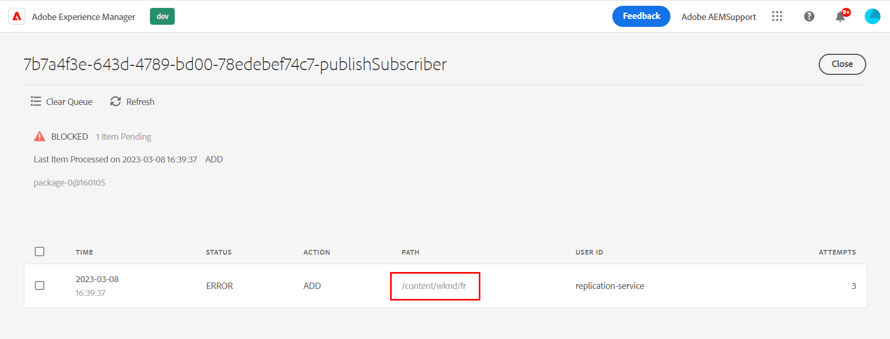

# 배포 큐가 AccessDeniedException으로 차단됨

## 설명 {#description}

&quot;빠른 게시&quot;, &quot;게시 관리&quot; 또는 &quot;복제&quot;를 사용하여 일부 페이지 콘텐츠(또는 XF 및 기타 종류의 리소스)를 복제하려고 하면 작성자의 배포 큐가 가져옵니다 <b>차단됨</b>.   다음을 확인하여 이를 확인할 수 있습니다. *게시*&#x200B;배포 UI의 배포 큐(AEM - 도구 - 배포 - 배포):    골든 게시자 큐(목록에서 굵게 표시되는 항목)를 선택하면 자세한 내용이 제공되고 특히 관련 내용이 제공됩니다 <b>경로</b> (여기에 여러 요소가 있을 수 있습니다.)    다음을 살펴보기 <b>로그</b> 탭에는 다음과 같은 해당 오류가 표시됩니다. 2023/03/08 12:11:26:238 - INFO - 배포 패키지 PackageMessage(pubSlingId=a1133c97-6809-411e-a435-4eea0ecbe889, reqType=ADD, pkgId=dstrpck-1678277486031-63159f4b-c577-4079-8741-d41660597d20, pkgType=journal_filevault, pkgLength=6330, pubAgentName=publish, userId=replication-service, paths=/content fr, deepPaths=) at offset=158705 2023/03/08 12:11:27:459 - 경고 - 메시지: 배포 패키지 PackageMessage(pubSlingId=a1133c97-6809-411e-a435-4eea0ecbe889, reqType=ADD, pkgId=dstrpck-1678277486031-63159f4b-c577-4079-8741-d41660597d20, pkgType=journal_filevault,Length=6330, pubAgentName=publish, userId-replication 가져오기 시도 실패 &#39;javax.jcr.AccessDeniedException: OakAccess0000: Access denied&#39;로 인해 offset=158705에서 paths=/content/wknd/fr, deepPaths=)로 인해 임포터가 나중에 다시 시도합니다. Stacktrace: org.apache.sling.distribution.common.DistributionException: javax.jcr.AccessDeniedException: OakAccess000: Access denied ..   다음을 수행해야 합니다. *큐 지우기* (또는 해당 항목을 제거) : 큐를 차단 해제합니다.

## 해결 방법 {#resolution}

다음과 같은 오류에도 불구하고 <b>javax.jcr.AccessDeniedException</b>, 배포 서비스 사용자에 대한 ACL / 권한과 아무 관계도 없을 수 있지만 다음 시나리오가 사용자에게 적용되지 않는 경우 이를 고려해야 합니다.

<u><b>진단</b></u>

복제된 콘텐츠에 특수 기능과 관련된 특정 구성이 있는 경우 위의 오류가 발생할 수 있습니다 <b>jcr:lockIsDeep</b> 속성.

진단을 확인하기 위해서는 검사를 해야 합니다 <b>언급된 각 경로</b> 다음 도구 중 하나를 사용하여 액세스할 수 있으며 적용할 수 있습니다.

1. 개발 인스턴스용 CRX/DE
2. 다음 [저장소 브라우저](https://experienceleague.adobe.com/docs/experience-manager-cloud-service/content/implementing/developer-tools/repository-browser.html?lang=ko-kr)
3. 패키지 관리자에서 컨텐츠 패키지 만들기(이 옵션은 해상도의 일부이기도 합니다)

그런 다음 다음을 확인해야 합니다 <b>jcr:content</b> 배포 큐 UI에 있는 각 경로의 노드를 선택하고 다음을 확인합니다.

- it <b>다음과 같음 </b>다음 권한 보유 <b>jcr:lockIsDeep=&quot;(부울)true&quot;</b> 속성
- it <b>다음이 아님 </b>다음 권한 보유 <b>jcr:lockOwner=&quot;xxx&quot;</b> 속성
- <b>(</b>it <b>다음이 아님</b> 다음 권한 보유 <b>혼합:잠금 가능</b> 의 값 <b>jcr:mixinTypes</b>)

이 경우 다음과 같은 이유로 문제가 확인됩니다. <b>jcr:lockIsDeep</b> 속성만 있으면 안 됩니다. 이 속성은 항상 와 함께 설정해야 합니다. <b>jcr:lockOwner</b> 조건 <b>잠금</b> 페이지.

만 설정할 수는 없습니다. <b>jcr:lockIsDeep</b> 속성은 JCR API를 사용하더라도 이 상황을 설명하는 근본 원인은 대부분 해당 단일 속성으로 &quot;손상된&quot; 콘텐츠 패키지를 설치한 것입니다.

<u><b>해상도</b></u>

콘텐츠를 수정하려면 해당 노드에 대한 올바른 속성이 설정된 패키지를 작성자에 설치하는 것이 유일한 해결책입니다.

해당 콘텐츠가 있는 다른 인스턴스에서 해당 패키지를 생성하거나 영향을 받는 인스턴스에만 이 콘텐츠가 있는 경우 다음 지침을 따를 수 있습니다.

1. 잘못된 페이지에 대해 손상된 인스턴스에 패키지 생성
2. 패키지 다운로드
3. 추출 <b>.content.xml</b> 페이지/jcr:content용
4. 이(가) 있는 줄을 수동으로 제거합니다. <b>jcr:lockIsDeep</b>
5. 새/고정 .content.xml로 패키지 업데이트
6. 수정된 패키지를 다시 업로드하고 설치합니다.

그런 다음 페이지 속성을 다시 확인하고 복제/배포를 성공적으로 테스트할 수 있습니다.
