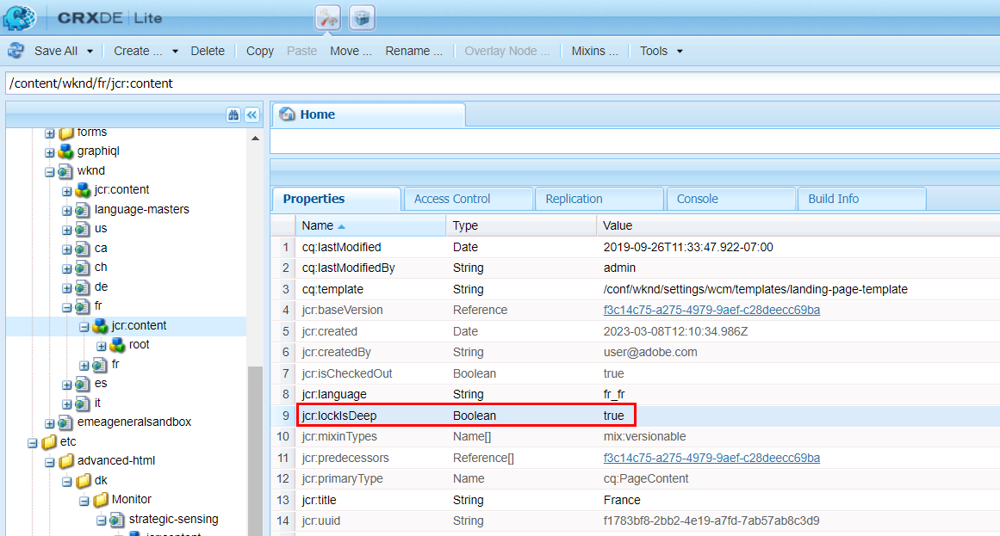

# AccessDeniedException로 차단된 배포 대기열

## 설명 {#description}

<b>환경</b>
- Experience Manager
- Experience Manager as a cloud service

<b>문제/증상</b> 빠른 게시&quot;, &quot;게시 관리&quot; 또는 &quot;복제&quot;를 사용하여 일부 페이지 컨텐츠(또는 XF 및 기타 리소스)를 복제하려고 하면 작성자의 배포 큐가 전송됩니다 <b>차단됨</b>.   다음을 확인하여 이를 확인할 수 있습니다 *게시*&#x200B;배포 UI의 배포 큐(AEM - 도구 - 배포 - 배포):    골든 게시자 대기열(목록에서 굵게 표시)을 선택하면 더 많은 세부 정보가 제공되며 특히 관련된 항목이 제공됩니다 <b>경로</b> (여기에 여러 요소가 있을 수 있습니다.)    을(를) 통해 <b>로그</b> 탭에는 다음 해당 오류가 표시됩니다. 2023/03/08 12:11:26:238 - INFO - 배포 패키지 PackageMessage(pubSlingId=a1133c97-6809-411e-a435-4eea0ecbe889, reqType=ADD, pkgId=dstrpck-1678277486031-63159f4b-c577-4079-8741-d41660597d20, pkgType=journal_filevault, pkgLength=6330, pubAgentName=publish, userId=replication-service, paths/content/wknd/fr/path= 111Offset1111Offset)=1OffsetTypeType=1:11:27:459 - 경고 - 메시지: 배포 패키지 PackageMessage(pubSlingId=a1133c97-6809-411e-a435-4eea0ecbe889, reqType=ADD, pkgId=dstrpck-1678277486031-63159f4b-c577-4079-8741-d41660597d20, pkgType=journal_filevault, pkgLength=6330, pubAgentName=publish, userId=replication-service, paths/content/wknd/fr, deepPaths=) atJaxOffset=158705.Access에 대한 Access=OffsetPath=PathPathPkgType=aType=a deniedException: OakAccess0000: 액세스가 거부되었습니다. 나중에 가져오기를 다시 시도합니다. Stacktrace: org.apache.sling.distribution.common.DistributionException: javax.jcr.AccessDeniedException: OakAccess0000: 액세스가 거부되었습니다.   다음을 수행해야 합니다. *큐 지우기* (또는 해당 항목을 제거)하여 큐의 차단을 해제합니다.

## 해결 방법 {#resolution}

오류가 발생했지만 <b>`javax.jcr.AccessDeniedException`</b>로 설정되면 배포 서비스 사용자에 대한 ACL / 권한과 관련된 것은 없을 수 있지만, 다음 시나리오가 해당 사례에 적용되지 않는 경우 이 문제를 고려해야 합니다.

진단

복제된 컨텐츠에 특수 구성과 관련된 특정 구성이 있는 경우에 위 오류가 발생할 수 있습니다 <b>jcr:lockIsDeep</b> 속성을 사용합니다.

진단을 확인하려면 다음을 검사해야 합니다 <b>언급된 각 경로</b> 다음 도구 중 하나를 사용하여 액세스/적용할 수 있습니다.

1. 개발 인스턴스용 CRX/DE
2. a [저장소 브라우저](https://experienceleague.adobe.com/docs/experience-manager-cloud-service/content/implementing/developer-tools/repository-browser.html?lang=ko-kr)
3. 패키지 관리자에서 컨텐츠 패키지 생성(이 옵션은 해상도의 일부입니다.)

그런 다음 <b>`jcr:content`</b> 분배 큐 UI에 있는 각 경로에 대해 노드 아래에 있고, 다음을 확인합니다.

- It <b>does </b>있음 <b>`jcr:lockIsDeep`=&quot;(부울)true&quot;</b> 속성
- It <b>포함하지 않음 </b>있음 <b>`jcr:lockOwner="xxx"`</b> 속성
- <b>(</b>it <b>포함하지 않음</b> 있음 <b>`mix:lockable`</b> 값에서 <b>`jcr:mixinTypes`</b>)

이 경우, <b>`jcr:lockIsDeep`</b> 속성은 단독으로 존재할 수 없습니다. 이 속성은 항상 와 함께 설정해야 합니다. <b>`jcr:lockOwner`</b> when <b>잠금</b> 페이지.

는 <b>`jcr:lockIsDeep`</b> 속성은 JCR API를 사용하더라도 이러한 상황을 설명하는 근본 원인은 대부분 해당 단일 속성으로 &quot;손상된&quot; 컨텐츠 패키지를 설치했기 때문입니다.

<u><b>해상도</b></u>

컨텐츠를 수정하려면 해당 노드에 올바른 속성이 설정된 작성자에 패키지를 설치하는 것이 유일한 솔루션입니다.

해당 컨텐츠가 있는 다른 인스턴스에서 해당 패키지를 만들거나 영향을 받는 인스턴스에 이 컨텐츠만 있는 경우 다음 지침을 따를 수 있습니다.

1. 잘못된 페이지에 대한 끊어진 인스턴스에 패키지 생성
2. 패키지 다운로드
3. 추출 <b>`.content.xml`</b> page/jcr:content용
4. 를 사용하여 수동으로 라인 제거 <b>jcr:lockIsDeep</b>
5. 새/fixed.content.xml로 패키지 업데이트
6. 수정된 패키지 다시 업로드 및 설치

그런 다음 페이지 속성을 다시 확인하고 복제/배포를 성공적으로 테스트할 수 있습니다.
