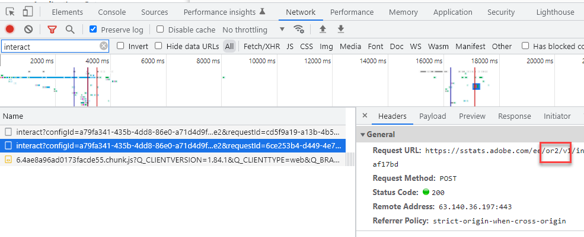

# Experience Platform 위치 힌트, AAM DCS 지역 노드 및 ID 서비스 위치 힌트

## 설명 {#description}

AEP WebSDK 위치 힌트, Experience Cloud ID 서비스 위치 힌트 및 AAM DCS 지역 노드 간의 관계는 무엇이며 이 관계를 이해하는 것이 중요한 이유는 무엇입니까?

## 해결 방법 {#resolution}

AEP WebSDK(Experience Edge로 데이터 전송) 및 Adobe Audience Manager(AAM) 실시간 데이터 수집은 전 세계에 분산된 지역 노드에서 수행됩니다. 7개의 서로 다른 지역 노드가 있으며 AEP WebSDK/Experience Edge와 AAM 데이터 수집은 동일한 노드를 사용합니다. AAM DCS(Data Collection Server)는 Experience Edge를 구성하는 것과 동일한 네트워크 인프라를 사용합니다. 마찬가지로, Experience Cloud ID 서비스는 AAM 기술을 사용하므로 ID 서비스 위치 힌트는 AAM 지역 데이터 수집 노드와 동일합니다. 즉, AAM DCS Nodes = ID 서비스 위치 힌트 = Experience Edge 위치 힌트입니다. AAM 지역 노드는 다음에 요약되어 있습니다. [설명서](https://experienceleague.adobe.com/docs/audience-manager/user-guide/api-and-sdk-code/dcs/dcs-api-reference/dcs-regions.html?lang=en)와 달리 Experience Edge의 지역 노드는 다음에 요약되어 있습니다 [설명서](https://experienceleague.adobe.com/docs/experience-platform/edge-network-server-api/location-hints.html?lang=en).

AAM 지역 노드 및 ID 서비스 위치 힌트는 숫자로 식별되고 Experience Edge는 영숫자로 식별되지만 모두 동일한 영역(브라질 제외)에 정렬됩니다.  아래 조회 테이블에는 조회 테이블이 어떻게 정렬되어 있는지 나와 있습니다.

| Experience Edge 위치 힌트 | AAM DCS Region 노드/ID 서비스 위치 힌트 |
| --- | --- |
| spg3 | ID: 3 호스트: apse.demdex.net |
| irl1 | ID: 6 Host: irl1.demdex.net |
| va6 | ID: 7 호스트: use.demdex.net |
| aus3 | ID: 8 호스트: apse2.demdex.net |
| or2 | ID: 9 호스트: usw2.demdex.net |
| jpn3 | ID: 11 호스트: tyo3.demdex.net |
| ind1 | ID: 12 Host: ind1.demdex.net |

실시간 응답이 필요한 대부분의 Adobe Experience Cloud 기능은 이러한 지역 노드를 활용합니다. ID 서비스 또는 Experience Edge에 대한 웹 페이지 또는 모바일 앱의 첫 번째 호출로 사용할 지역 노드가 결정됩니다. 위치 힌트는 다음 호출에 대한 응답에서 찾을 수 있습니다.

Experience Cloud ID 서비스:

AEP 웹 SDK:

최종 사용자에게 가장 가까운 지역 노드가 결정되면 Analytics, Target 및 AEP WebSDK 호출로 전달되는 지역 식별자가 앞으로 변경됩니다. Analytics에서는 aamlh 쿼리 문자열 매개 변수로 전달됩니다.

Target 시 요청 페이로드의 experienceCloud.audienceManager.locationHint 개체에 전달됩니다.

AEP 웹 SDK의 경우 호출 경로가 지역 노드를 반영하도록 업데이트됩니다.

<b>참고: </b>AEP WebSDK의 첫 번째 상호 작용 호출은 영역이 아직 결정되지 않았으므로 경로에 영역이 없으나 (위에 언급된 대로) 응답에 있습니다. 경로는 ..../ee/v1/.... 그러나 후속 호출에는 /ee/와 /v1/ 경로 요소 사이의 지역 노드 정보가 포함됩니다

이러한 매개 변수는 서버측에서 전달된 Analytics 데이터가 올바른 AAM 에지 노드로 전달되고, Target이 동일한 에지 노드에서 세그먼트 정보를 요청하고, [AEP 데이터가 AAM으로 데이터를 전송합니다.](https://experienceleague.adobe.com/docs/audience-manager/user-guide/implementation-integration-guides/integration-experience-platform/aam-aep-audience-sharing.html?lang=en)(및 대상 라이브러리)가 지역 노드를 수정합니다.

이 정보는 Adobe 솔루션에 비표준 방식으로 서버측 또는 클라이언트측 히트를 보낼 때 알아야 합니다. 예를 들어, 순수하게 ECID를 AEP 프로필과 동기화하기 위해 페이지에서 수동으로 생성된 WebSDK 호출은 올바른 Experience Edge 지역 노드로 전송되어야 합니다. 그렇지 않은 경우 AEP에서 AAM으로 공유된 모든 데이터는 AAM 백엔드 데이터베이스로 이동한 다음, AAM에서 해당 데이터를 각 에지 노드로 푸시하는 데 추가로 48시간이 걸리기 때문에 AAM으로 전송된 모든 AEP 세그먼트를 Target에서 사용할 수 있는 시간이 크게 느려집니다. 또는 서버측 Analytics 요청이 노드 7로 전송되지만 Target의 페이지 내 Target 구현이 영역 9를 사용하는 경우 데이터가 AAM 미국 동부 노드로 전달되는 반면, 세그먼트 정보는 미국 서부 노드에 ping됩니다. 최종 사용자는 최종 노드가 24~48시간 후 동기화되기 전까지 대상 라이브러리 대상/AAM 세그먼트를 사용하여 Target 활동을 수행할 자격이 없습니다. 다음을 사용하여 ECID를 가져오는 것이 이러한 사용 사례의 표준 사례입니다. [getMarketingCloudVisitorID](https://experienceleague.adobe.com/docs/id-service/using/id-service-api/methods/getmcvid.html?lang=en) (ID 서비스) 또는 [getIdentity](https://experienceleague.adobe.com/docs/experience-platform/edge/extension/accessing-the-ecid.html?lang=en) (Web SDK) 함수. 그러나 ECID를 가져오는 것 외에도 위치 힌트도 를 사용하여 검색하고 사용해야 합니다. [getLocationHint](https://experienceleague.adobe.com/docs/id-service/using/id-service-api/methods/getlocationhint.html?lang=en) (ID 서비스) 함수 또는 웹 SDK 호출의 응답 페이로드에서 검색합니다.

