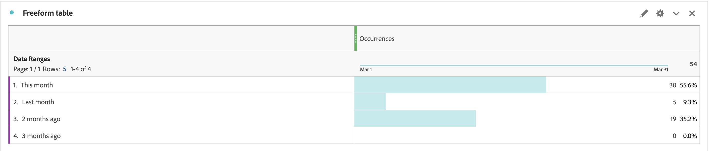

# Workspace 보고서에서 날짜 범위 Dimension 순서를 수동으로 정렬하는 방법

## 설명 {#description}

문제:
  
 &quot;이번 달&quot; &quot;지난달&quot; &quot;2개월 전&quot; &quot;3개월 전&quot; 순서로 날짜 범위 Dimension을 정렬하려고 합니다.  하지만 정렬 아이콘을 클릭하면 다른 순서로 표시됩니다. Dimension 순서를 수동으로 정렬하려면 어떻게 해야 합니까?  
            

## 해결 방법 {#resolution}

테이블 빌더 기능을 사용하여 Dimension 순서를 수동으로 지정할 수 있습니다.

자유 형식 테이블을 열고 &quot;테이블 빌더 활성화&quot; 단추를 클릭합니다

원하는 순서대로 Dimension을 테이블에 놓고 Build 단추를 클릭합니다.

이제 Dimension이 &quot;This Month&quot; &quot;Last Month&quot; &quot;2개월 전&quot; &quot;3개월 전&quot;에서 설정한 순서대로 정렬됩니다.

