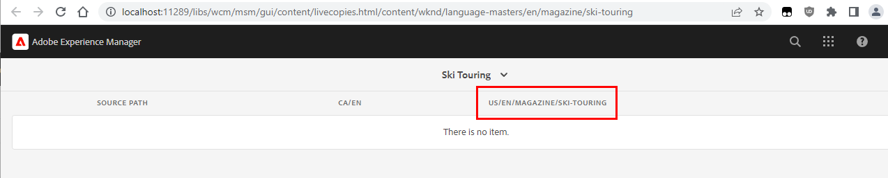

# 내부 라이브 카피에 대한 롤아웃 중에 참조가 업데이트되지 않음

내부 라이브 카피에 대한 롤아웃 중에 참조가 업데이트되지 않으면 다중 사이트 관리자(MSM) 업데이트 작업에 대한 특정 구성을 활성화하여 *중첩 라이브 카피 간 참조 업데이트*. 이 문서에 설명된 단계에 따라 문제를 해결하십시오.

## 설명 {#description}

### <b>환경</b>

- Experience Manager as a Cloud Service
- Experience Manager 6.5

### <b>문제/증상</b>

중첩된/내부 라이브 카피를 만들 때 페이지 콘텐츠의 참조는 롤아웃 중에 해당하는 라이브 카피로 업데이트되지 않습니다(대신 블루프린트 경로를 참조).

다음과 같은 여러 가지 이유로 인해 내부 Live Copy를 만들 수 있습니다.

- 수동으로 생성하여(<b>만들기</b> `>`  <b>Live Copy</b>)
- 또는 를 편집하여 <b>Live Copy</b> 라이브 카피 루트의 하위 페이지 속성

예를 들어 WKND 샘플 웹 사이트를 고려하는 경우 다음과 같은 BluePrint/LiveCopy 구조가 있습니다.

- <b>블루프린트:</b> /content/wknd/language-masters/en
- <b>라이브 카피:</b> /content/wknd/us/en 및 /content/wknd/ca/en

이제 페이지의 페이지 속성을 열면 */content/wknd/us/en/magazine/ski-touring* (하위 페이지 내) */content/wknd/us/en* Live Copy).

다음으로 이동 <b>Live Copy</b> 탭 및 속성 변경(<b>Live Copy 상속</b>, <b>상위 항목에서 롤아웃 구성 상속</b>, ...)는 내부 Live Copy를 만듭니다.

이는 의 존재/생성에서 확인할 수 있습니다. *cq:LiveSyncConfig* 위치: */content/wknd/us/en/magazine/ski-touring/jcr:content/cq:LiveSyncConfig*.

블루프린트 라이브 카피 대시보드(BP 페이지 속성으로 이동한 다음 블루프린트로 이동한 다음 라이브 카피 개요로 이동)도 다음에서 변경됩니다.

끝:

## 해결 방법 {#resolution}

내부 라이브 카피에 참조를 올바르게 다시 작성하려면 다중 사이트 관리자(MSM) 업데이트 작업에 대한 특정 구성을 활성화해야 합니다 *중첩 라이브 카피 간 참조 업데이트*.

<b>자세한 내용은 해당 설명서를 참조하십시오.</b>

[https://experienceleague.adobe.com/docs/experience-manager-cloud-service/content/sites/administering/reusing-content/msm/live-copy-sync-config.html#configuring-synchronization-for-updating-references](https://experienceleague.adobe.com/docs/experience-manager-cloud-service/content/sites/administering/reusing-content/msm/live-copy-sync-config.html#configuring-synchronization-for-updating-references)

[https://experienceleague.adobe.com/docs/experience-manager-65/administering/introduction/msm-sync.html#configuring-synchronization-for-updating-references](https://experienceleague.adobe.com/docs/experience-manager-65/administering/introduction/msm-sync.html#configuring-synchronization-for-updating-references)

다음 단계에 따라 OSGi(Open Service Gateway Initiative) 구성 파일을 배포하거나 해당되는 경우 OSGi 웹 콘솔에서 변경 작업을 수행합니다.

1. 액세스 <b>웹 콘솔</b> 다음으로 이동 <b>OSGi</b> 다음으로 이동 <b>구성</b> [(http://localhost/system/console/configMgr)](http://localhost/system/console/configMgr)

2. 검색 <b>CQ MSM 참조 업데이트 작업</b> (`com.day.cq.wcm.msm.impl.actions.ReferencesUpdateActionFactory`)

3. 확인란 활성화 <b>중첩 라이브 카피 간 참조 업데이트</b>

