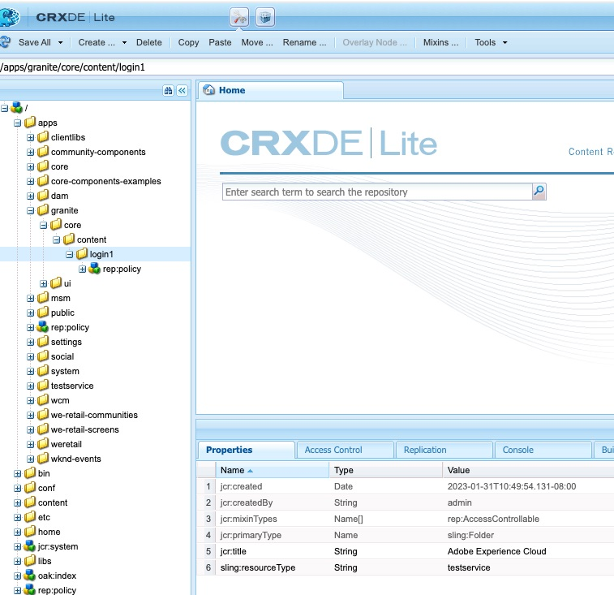

# AEM OAuth 흐름 실패 시 사용자 지정 로그인 페이지로 리디렉션하는 방법

## 설명 {#description}

<b>환경</b>
Experience Manager

<b>문제/증상</b>
AEM Open Authorization(OAuth) 흐름 실패 시 AEM(Adobe Experience Manager) 게시 환경에서 사용자 지정 로그인 페이지로 리디렉션하는 방법

## 해결 방법 {#resolution}

SAML(보안 검증 마크업 언어)/OAuth 흐름의 경우 AEM 인증 흐름에 오류가 있으면 시스템이 기본 OOTB(기본 제공) AEM 로그인 페이지로 리디렉션됩니다.

따라서 사용자를 사용자 지정 SAML/OAuth IDP 로그인 페이지로 리디렉션해야 합니다. 아래 설명된 단계를 따르십시오.

1. 이 노드 경로 복사 */libs/granite/core/content/login* to */apps/granite/core/content/login1* 아래와 같이 변경하는 것을 의미합니다.
2. 리소스 유형 변경 */apps/granite/core/content/login1* to <b>testservice</b>를 아래와 같이 표시합니다.
3. 만들기 `rep:policy` login1 아래의 노드 <b>하위 항목 허용</b>를 아래와 같이 표시합니다.
4. 만들기 <b>testservice</b> 아래의 폴더 <b>/apps</b> 및 추가 <b>sling:resourceType</b> with <b>testservice</b> 그리고 <b>testservice.jsp</b>를 아래와 같이 표시합니다.
5. OSGI 구성을 엽니다. <b>Adobe Granite 로그인 선택기 인증 핸들러</b> 기본 로그인 페이지를 */apps/granite/core/content/login1* 사용자 지정 `auth.loginselector.mappings` 보안 경로에 대한 내 오버레이된 로그인 페이지를 가리키는 속성입니다. 아래를 참조하십시오.
6. OSGI 구성을 엽니다. <b>Apache Sling 인증 서비스</b> 및 추가 *-/apps/granite/core/content/login1* 및 *-/apps/testservice*&#x200B;변환 후 `sling.auth.requirements` 목록. 아래를 참조하십시오.

