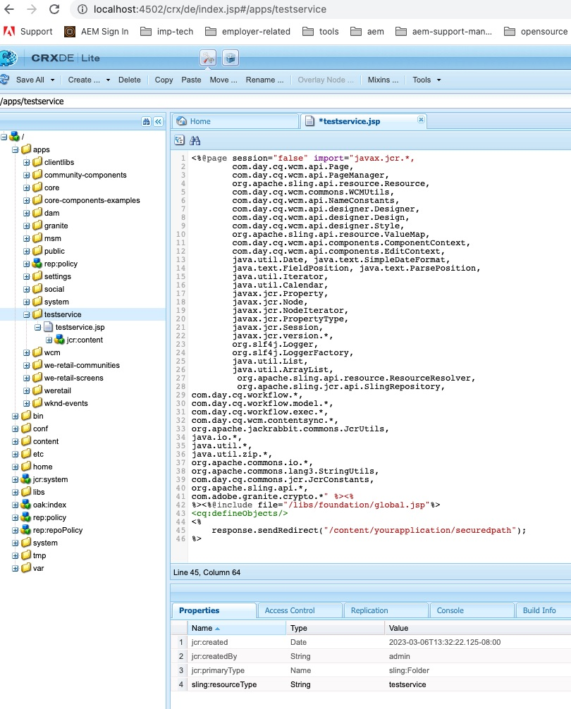

# AEM OAuth 흐름 실패 시 사용자 지정 로그인 페이지로 리디렉션하는 방법

사용자를 사용자 정의 로그인 페이지로 리디렉션하여 AEM OAuth 흐름 실패 시 사용자 정의 로그인 페이지로 리디렉션하는 방법에 대해 알아봅니다.

## 설명 {#description}

### <b>환경</b>

Experience Manager

### <b>문제/증상</b>

AEM Open Authorization(OAuth) 흐름 오류가 발생하는 경우 Adobe Experience Manager(AEM) 게시 환경의 사용자 지정 로그인 페이지로 리디렉션하는 방법은 무엇입니까?

## 해결 방법 {#resolution}

SAML(Security Assertion Markup Language)/OAuth 흐름의 경우 AEM 인증 흐름에 오류가 있으면 시스템이 기본 제공(OOTB) AEM 로그인 페이지로 리디렉션합니다.

따라서 사용자를 사용자 지정 SAML/OAuth IDP 로그인 페이지로 리디렉션해야 합니다. 아래 단계를 따르십시오.

1. 이 노드 경로 복사 */libs/granite/core/content/login* 끝 */apps/granite/core/content/login1* 아래와 같이 표시됩니다.
2. 의 리소스 유형 변경 */apps/granite/core/content/login1* 끝 <b>testservice</b>, 아래와 같이 표시됩니다.
3. 만들기 `rep:policy` 로그인1 아래에 있는 노드 <b>하위 항목 허용</b>, 아래와 같이 표시됩니다.
4. 만들기 <b>testservice</b> 폴더 <b>/apps</b> 및 추가 <b>sling:resoureType</b> 포함 <b>testservice</b> 및 라는 JSP 파일 만들기 <b>testservice.jsp</b>, 아래와 같이 추가합니다. (참고: OAuth 흐름의 경우 다음을 추가하십시오. */j_security_check?configid=`<` 각 oauth confiid`>`* 에서 보안 리디렉션 경로로 <b>JSP</b> 아래)
5. OSGI 구성 열기 <b>Adobe Granite 로그인 선택기 인증 핸들러</b> 기본 로그인 페이지를 다음으로 변경 */apps/granite/core/content/login1* 및 사용자 지정 `auth.loginselector.mappings` 속성이 보안 경로에 대해 오버레이된 내 로그인 페이지를 지정합니다. 아래를 참조하십시오.
6. OSGI 구성 열기 <b>Apache Sling 인증 서비스</b> 및 추가 *-/apps/granite/core/content/login1* 및 *-/apps/testservice*(으)로 `sling.auth.requirements` 목록을 표시합니다. 아래를 참조하십시오.
