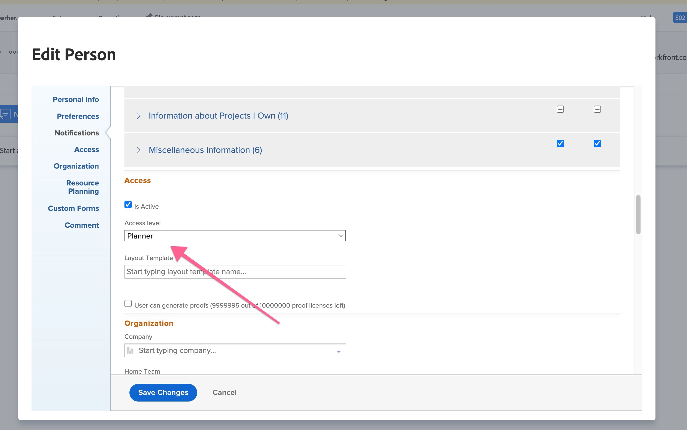

# 증명을 업로드하는 중 증명 문제, 블루바가 무기한 스크롤됨

## 설명 {#description}

### 환경

Workfront

### 문제/증상

새 증명을 업로드할 때 새 증명 추가 섹션에는 화면을 무기한 스크롤하는 파란색 막대가 표시됩니다.

## 해결 방법 {#resolution}

1. 클릭 <b>시스템 관리자</b> `>`  <b>설정 </b>`>` <b>다음으로 로그인 </b>`>`  (사용자로 로그인).
2. 로 이동 <b>문서 탭 </b>새 문서를 업로드하려면
3. <b>새 증명 만들기</b> 을(를) 사용자로 하여 재현할 수 있는지 확인합니다.
4. 그래도 계속 문제가 된다면,<b> 로그아웃 </b>을 로 사용하십시오.
5. 를 엽니다. <b>사용자 프로필</b>. 사용자는에서 찾을 수 있습니다. *사용자 목록* 또는 검색 영역으로 이동하여 사용자를 검색하고 선택합니다.
6. 편집 <b>사용자 계정입니다.</b>
7. 아래로 스크롤하여 <b>사용자 액세스 수준</b> Workfront에서 해당 정보를 기록합니다. <b></b>
8. 변경 <b>사용자 액세스 수준</b> 끝 *검토자* 및 *저장.*
9. 사용자 편집 페이지로 돌아가서 <b>액세스 수준 변경</b> 사용자가 원래 가지고 있던 것으로 돌아갑니다.
