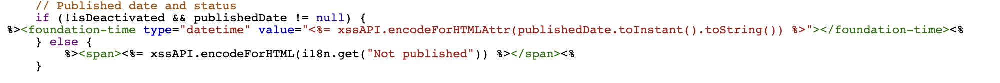
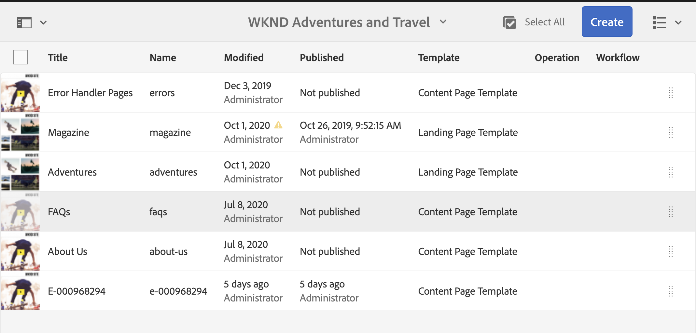

# Adobe Experience Manager: 사이트 콘솔에서 게시된 페이지의 표시 형식을 사용자 지정하는 방법

## 설명 {#description}

AEM 페이지가 게시된 날짜는 사이트 콘솔에 표시되지만 시간은 표시되지 않습니다.
이 섹션에서는 시간을 포함하도록 게시된 날짜의 날짜/시간 형식을 사용자 지정하는 방법을 설명합니다.

<b>환경</b>
AEM AEM 6.5, as a Cloud Service

## 해결 방법 {#resolution}

각 열 및 목록 보기에 대한 오버레이를 만듭니다.

열 보기의 경우 /libs/cq/gui/components/coral/admin/page/columnpreview/columnpreview.jsp이 오버레이됩니다.
  이전

After: foundation-time 태그에 type=&quot;datetime&quot; 속성을 추가합니다.

목록 보기의 경우 /libs/cq/gui/components/coral/admin/page/row/row.jsp이 오버레이됩니다.
  이전

After: foundation-time 태그에 type=&quot;datetime&quot; 속성을 추가합니다.

