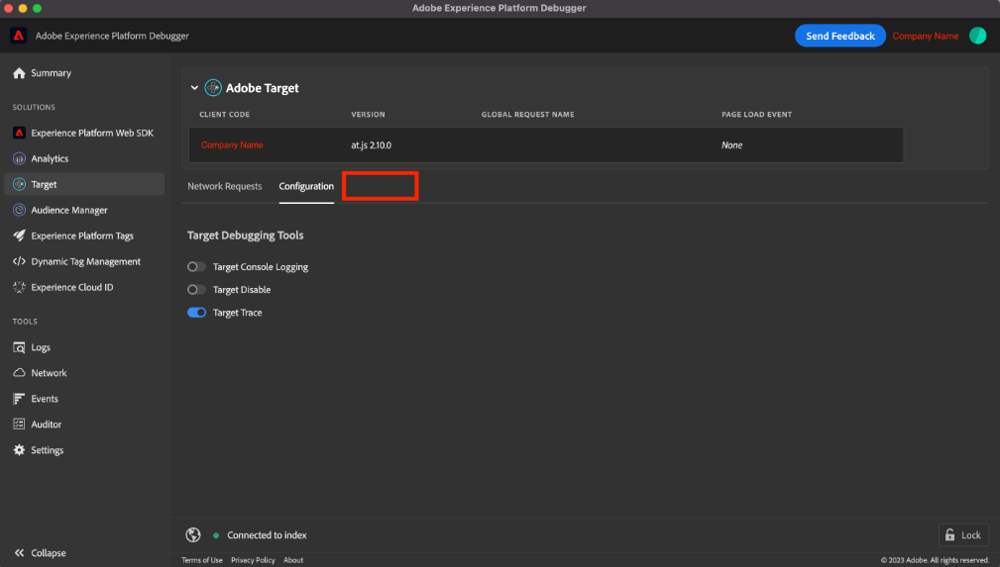

# &quot;Target 추적&quot;이 Adobe Experience Platform Debugger에 표시되지 않음

If <b>대상 추적 </b>가 AEP Debugger에 표시되지 않습니다. Adobe Target이 사용되는 조직에 로그인하고 를 활성화하십시오. <b>대상 추적 </b>토글.

## 설명 {#description}

### 환경

- Adobe Experience Platform
- Adobe Target

### 문제/증상

다음 <b>대상 추적</b> Adobe Experience Platform Debugger에 탭이 표시되지 않습니다.

## 해결 방법 {#resolution}

먼저 다음 조건을 확인하십시오.

- 사용자는 웹 사이트에서 Adobe Target이 사용되는 조직에 로그인해야 합니다.
- 다음 <b>대상 추적</b> 전환 스위치 <b>Target</b> `>`  <b>구성</b> `>`  <b>Target 디버깅 도구</b> 섹션을 활성화해야 합니다.

위의 조건에도 불구하고 문제가 지속되는 경우 아래 단계를 수행하십시오.

- 새 브라우저 프로필 만들기

  <u>Chrome 브라우저에서</u>:

   1. 오른쪽 상단 모서리에서 프로필 아이콘 을 클릭한 다음 을 클릭합니다 <b>추가</b>.
   2. 새 프로필에 대한 Adobe Experience Platform Debugger 확장을 설치합니다.
- 브라우저 설정을 기본값으로 재설정

  <u>Chrome 브라우저에서</u>:

   1. 오른쪽 상단에서 을 선택합니다. <b>자세히</b> 아이콘을 클릭한 다음 로 이동 <b>설정</b>.
   2. 선택 <b>설정 재설정</b> `>`  <b>설정을 원래 기본값으로 복원</b> `>`  <b>설정 재설정</b>.
   3. 설정이 재설정된 후 Adobe Experience Platform Debugger 확장을 다시 활성화합니다.
